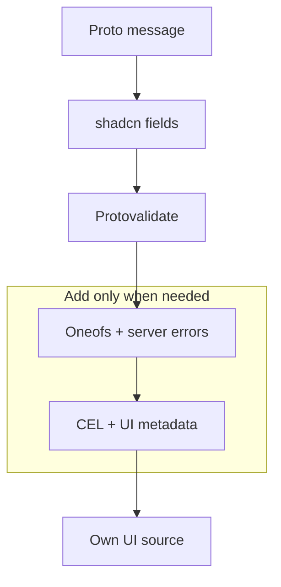

## 1. 新增 registry

在 `components.json` 中，將命名空間指向不可變的穩定版 registry 快照：

```json
{
  "registries": {
    "@protoform": "https://raw.githubusercontent.com/malinskibeniamin/protoform/v1.0.0/public/r/{name}.json"
  }
}
```

固定 Git 標籤，避免日後上游變更影響現有安裝。保留
`/r/{name}.json` 路徑，讓 shadcn 能解析每個 `@protoform` 項目。

接著安裝：

```bash
bunx shadcn@latest add @protoform/protoform
```

registry 會將 hook、protobuf provider、共用欄位模型和 UI 元件複製到你的
應用程式中。你可以隨應用程式檢視、重新設計樣式並版本控管所有原始碼。

## 2. 設定公開 Buf registry

Buf 透過其公開 npm registry 發布產生的 Google API 模組。將其 scope 新增至
使用端的 `.npmrc`：

```ini title=".npmrc"
@buf:registry=https://buf.build/gen/npm/v1/
```

不需要 token。registry 項目已宣告此模組及所有其他公開的第三方
相依套件，因此 `shadcn add` 會連同複製的原始碼一起安裝它們。沒有 Protoform 自有的 npm
套件。

## 3. 建立 protobuf 訊息

```proto
syntax = "proto3";

package example.v1;

import "buf/validate/validate.proto";

message SignupRequest {
  string email = 1 [(buf.validate.field).string.email = true];
  string display_name = 2 [(buf.validate.field).string = {
    min_len: 2
    max_len: 40
  }];
}
```

使用 Buf 產生 TypeScript，接著將產生的 schema 傳給 `useProtoForm`。

若使用端 repository 需要重新產生表單繫結，請安裝原始碼產生器：

```bash
bunx shadcn@latest add @protoform/protoc-gen-protoform
```

```yaml
# buf.gen.yaml
version: v2
plugins:
  - local: ["bun", "run", "scripts/protoc-gen-protoform/run.ts"]
    out: src/gen
    opt: target=ts,import_extension=js
```

Protoform 僅支援 Protobuf-ES v2 schema。若應用程式仍產生 v1 訊息
類別，請先依照[遷移至 Protobuf-ES v2](/docs/protobuf-v2-migration)操作，再整合
表單 runtime。

## 4. 從簡單開始，再逐步擴充



若要查看完整的五個 RPC 操作指南，請安裝 bookstore 項目：

```bash
bunx shadcn@latest add @protoform/bookstore
```

其中包含產生的繫結、建立與編輯的 React Hook Form 流程、AutoForm 刪除功能，以及
範圍受限的記憶體內範例服務。
