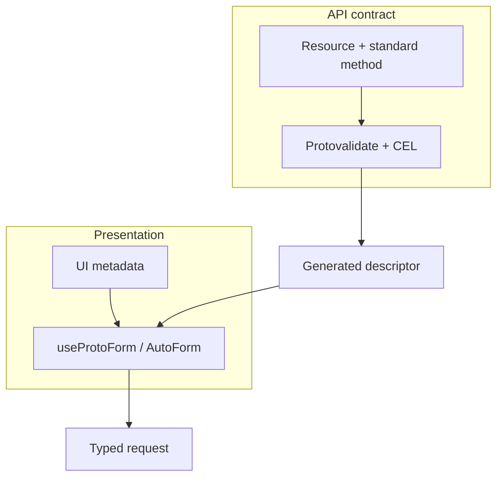

Protoform 最適合搭配資源導向的 protobuf API。它會保留資源、驗證與呈現層，而不是以僅供前端使用的 DTO 取代它們。

Protoform 不會讓任意 API 自動符合 AIP。API 擁有者仍須定義並強制執行資源名稱、標準方法、分頁、更新遮罩、並行控制與長時間執行作業的語意。接著，Protoform 會將該契約投射為型別化表單。

[正式環境就緒度儀表板](/docs/production-readiness)會將表單相關的 AIP 支援與僅限後端的語意分開衡量。每個適用的用戶端工作流程都有可執行證據，而後端與治理責任則會繼續以外部排除項目的形式呈現。

## 完整追蹤 General AIP 目錄

官方 [General AIP 目錄](https://google.aip.dev/general)是完整 General AIP 目錄的基準。每個目錄項目在就緒度分類帳中都有自己的穩定資料列。每列使用明確的就緒狀態：

- Protoform 負責的行為使用**可執行一致性驗證**，例如描述元投射、欄位行為、更新遮罩、型別化請求、結構化錯誤與遮蔽。
- protobuf 宣告可證明規則中表單可見部分時，使用**靜態結構描述檢查**，例如資源關聯、請求 ID、`validate_only`、資源修訂版本、軟刪除、狀態、到期與批次方法。
- 適用但目前沒有證據的用戶端行為標示為**延後**或**不支援**。這些資料列會降低就緒度，並指出下一個可執行測試。
- Protoform 無法實作的後端強制執行、治理或儲存庫所有權標示為**外部**。這些資料列仍會顯示，但不計入分母。

**僅有文件不算是**就緒度證據。指南可以說明 AIP，但只有可執行測試或靜態結構描述判斷提示能將適用的資料列標示為已驗證。AIP-192 已通過驗證，因為產生器測試證明公開訊息與欄位註解會成為已註冊的表單說明。

| 目錄系列 | 追蹤項目 | 目前責任歸屬 |
| --- | --- | --- |
| 中繼資料與流程 | [AIP-1](https://google.aip.dev/1), [AIP-2](https://google.aip.dev/2), [AIP-3](https://google.aip.dev/3), [AIP-8](https://google.aip.dev/8), [AIP-9](https://google.aip.dev/9), [AIP-100](https://google.aip.dev/100), [AIP-200](https://google.aip.dev/200), [AIP-205](https://google.aip.dev/205) | 外部提案與 API 審查治理 |
| API 概念 | [AIP-111](https://google.aip.dev/111) | 外部後端平面邊界 |
| 資源設計 | [AIP-121](https://google.aip.dev/121), [AIP-122](https://google.aip.dev/122), [AIP-123](https://google.aip.dev/123), [AIP-124](https://google.aip.dev/124), [AIP-126](https://google.aip.dev/126), [AIP-128](https://google.aip.dev/128), [AIP-129](https://google.aip.dev/129), [AIP-156](https://google.aip.dev/156) | 針對資源、關聯、列舉、宣告式控制項、伺服器預設值與單例進行可執行或靜態檢查 |
| 作業 | [AIP-130](https://google.aip.dev/130), [AIP-131](https://google.aip.dev/131), [AIP-132](https://google.aip.dev/132), [AIP-133](https://google.aip.dev/133), [AIP-134](https://google.aip.dev/134), [AIP-135](https://google.aip.dev/135), [AIP-136](https://google.aip.dev/136), [AIP-151](https://google.aip.dev/151), [AIP-231](https://google.aip.dev/231), [AIP-233](https://google.aip.dev/233), [AIP-234](https://google.aip.dev/234), [AIP-235](https://google.aip.dev/235) | 標準、批次、自訂、串流與長時間執行方法皆已分類；作業進度、輪詢、取消與終止錯誤均已驗證 |
| 欄位 | [AIP-140](https://google.aip.dev/140), [AIP-141](https://google.aip.dev/141), [AIP-142](https://google.aip.dev/142), [AIP-143](https://google.aip.dev/143), [AIP-144](https://google.aip.dev/144), [AIP-145](https://google.aip.dev/145), [AIP-146](https://google.aip.dev/146), [AIP-147](https://google.aip.dev/147), [AIP-148](https://google.aip.dev/148), [AIP-149](https://google.aip.dev/149), [AIP-202](https://google.aip.dev/202), [AIP-203](https://google.aip.dev/203), [AIP-216](https://google.aip.dev/216) | 數量單位、標準化字串代碼、半開放範圍、敏感欄位與核心欄位行為均已驗證 |
| 設計模式 | [AIP-152](https://google.aip.dev/152), [AIP-153](https://google.aip.dev/153), [AIP-154](https://google.aip.dev/154), [AIP-155](https://google.aip.dev/155), [AIP-157](https://google.aip.dev/157), [AIP-158](https://google.aip.dev/158), [AIP-159](https://google.aip.dev/159), [AIP-160](https://google.aip.dev/160), [AIP-161](https://google.aip.dev/161), [AIP-162](https://google.aip.dev/162), [AIP-163](https://google.aip.dev/163), [AIP-164](https://google.aip.dev/164), [AIP-165](https://google.aip.dev/165), [AIP-210](https://google.aip.dev/210), [AIP-211](https://google.aip.dev/211), [AIP-214](https://google.aip.dev/214), [AIP-217](https://google.aip.dev/217), [AIP-236](https://google.aip.dev/236) | 工作、匯入／匯出、跨集合、依條件刪除、部分回應、無法連線資源、政策預覽與其餘由用戶端負責的模式均已驗證；授權強制執行屬於外部責任 |
| 相容性與版本管理 | [AIP-180](https://google.aip.dev/180), [AIP-181](https://google.aip.dev/181), [AIP-182](https://google.aip.dev/182), [AIP-185](https://google.aip.dev/185) | 相容性、相依性、套件版本、預覽與淘汰呈現均已驗證 |
| 完善度 | [AIP-190](https://google.aip.dev/190), [AIP-191](https://google.aip.dev/191), [AIP-192](https://google.aip.dev/192), [AIP-193](https://google.aip.dev/193), [AIP-194](https://google.aip.dev/194) | 命名、版面配置、產生的原始碼說明、標準錯誤與具冪等性意識的重試復原均已驗證 |
| Protocol buffers | [AIP-127](https://google.aip.dev/127), [AIP-213](https://google.aip.dev/213), [AIP-215](https://google.aip.dev/215) | 常見元件與 HTTP 路徑、查詢及本文角色均已驗證；API 專屬 proto 的所有權屬於外部責任 |

從選擇性加入的子路徑匯入描述元與用戶端工作流程輔助函式。這可讓只使用核心表單提供者的應用程式不必包含長時間執行作業的中繼資料。

```ts
import {
  getProtoPartialResult,
  getProtoRetryDecision,
  runProtoOperation,
} from "@/lib/protobuf-provider/aip-client-workflow";
import { getProtoMethodWorkflow } from "@/lib/protobuf-provider/method-workflow";
```

已驗證的範圍刻意保持狹窄。AIP-154 表示 Protoform 會保留 `etag`，不表示它會強制執行並行控制。AIP-158 表示分頁欄位維持型別化且權杖保持不透明，不表示用戶端會證明伺服器游標的穩定性。AIP-160 表示請求會攜帶 `filter` 與 `order_by`，不表示 UI 程式碼會授權或評估篩選器。AIP-194 表示 Protoform 只會重試明確具冪等性的單元 `UNAVAILABLE` 呼叫；服務擁有者仍須設定底層重試政策。



## 標準資源形狀

資源遵循 [AIP-121](https://google.aip.dev/121)、[AIP-122](https://google.aip.dev/122) 與 [AIP-123](https://google.aip.dev/123)：

```proto
import "buf/validate/validate.proto";
import "google/api/field_behavior.proto";
import "google/api/resource.proto";

message Connector {
  option (google.api.resource) = {
    type: "example.googleapis.com/Connector"
    pattern: "projects/{project}/locations/{location}/connectors/{connector}"
    singular: "connector"
    plural: "connectors"
  };

  string name = 1 [(google.api.field_behavior) = IDENTIFIER];
  string display_name = 2 [
    (google.api.field_behavior) = REQUIRED,
    (buf.validate.field).string.min_len = 1
  ];
  ConnectorState state = 3 [(google.api.field_behavior) = OUTPUT_ONLY];
  string etag = 4 [(google.api.field_behavior) = OUTPUT_ONLY];
}

enum ConnectorState {
  CONNECTOR_STATE_UNSPECIFIED = 0;
  CONNECTOR_STATE_ACTIVE = 1;
  CONNECTOR_STATE_FAILED = 2;
}
```

此形狀是刻意設計的：

- `name` 是欄位 1，包含完整的相對資源名稱，且僅具有 `IDENTIFIER`。
- 顯示文字使用獨立的 `display_name` 欄位；單純的 ID 絕不會偽裝成 `name`。
- `(google.api.resource)` 宣告 `type`、`pattern`、`singular` 與 `plural`。
- `field_behavior` 記錄用戶端責任；`buf.validate` 與 CEL 強制執行值的規則。
- 列舉的零值以 `_UNSPECIFIED` 結尾。
- 伺服器擁有的 `state` 與 `etag` 欄位在編輯表單中為唯讀。

## 標準方法請求

使用標準請求形狀，不要使用自訂作業封套：

```proto
import "google/protobuf/field_mask.proto";

message GetConnectorRequest {
  string name = 1 [
    (google.api.field_behavior) = REQUIRED,
    (google.api.resource_reference).type = "example.googleapis.com/Connector"
  ];
}

message ListConnectorsRequest {
  string parent = 1 [
    (google.api.field_behavior) = REQUIRED,
    (google.api.resource_reference).child_type = "example.googleapis.com/Connector"
  ];
  int32 page_size = 2;
  string page_token = 3;
  string filter = 4;
  string order_by = 5;
}

message ListConnectorsResponse {
  repeated Connector connectors = 1;
  string next_page_token = 2;
}

message CreateConnectorRequest {
  string parent = 1 [
    (google.api.field_behavior) = REQUIRED,
    (google.api.resource_reference).child_type = "example.googleapis.com/Connector"
  ];
  Connector connector = 2 [(google.api.field_behavior) = REQUIRED];
  string connector_id = 3 [
    (google.api.field_behavior) = REQUIRED,
    (buf.validate.field).string.pattern = "^[a-z][a-z0-9-]{2,62}$"
  ];
}

message UpdateConnectorRequest {
  Connector connector = 1 [(google.api.field_behavior) = REQUIRED];
  google.protobuf.FieldMask update_mask = 2
    [(google.api.field_behavior) = REQUIRED];
}

message DeleteConnectorRequest {
  string name = 1 [
    (google.api.field_behavior) = REQUIRED,
    (google.api.resource_reference).type = "example.googleapis.com/Connector"
  ];
  string etag = 2;
}
```

| 方法 | AIP 契約 | 表單責任 |
| --- | --- | --- |
| Get / Delete | 傳送完整資源 `name`；Delete 可傳送 `etag` | 將識別資訊與可編輯的顯示欄位分開 |
| List | 傳送 `parent`、`page_size`、不透明的 `page_token`、字串 `filter` 與 `order_by` | 將權杖視為不透明，並在分頁期間保持篩選條件穩定 |
| Create | 傳送 `parent`、`connector` 與 `connector_id`；忽略 `connector.name` | 在資源本文之外驗證 ID 格式 |
| Update | 傳送資源與必要的 `update_mask` | 從可編輯的變更建立遮罩，絕不包含伺服器擁有的欄位 |

## 自動產生最小更新遮罩

AutoForm 會在每次提交時，根據原生 React Hook Form 或 TanStack Form 的已變更狀態計算符合 AIP 安全性的遮罩。第三個提交引數會將其公開為 `context.updateMask`：

```tsx
<AutoForm
  defaultValues={profile}
  schema={MaskableProfileSchema}
  withSubmit
  onSubmit={async (nextProfile, _form, context) => {
    if (!context.updateMask?.paths.length) return;

    await updateProfile(create(UpdateMaskableProfileRequestSchema, {
      profile: nextProfile,
      updateMask: context.updateMask,
    }));
  }}
/>
```

較低階的 hook 透過 `createUpdateMask()` 公開相同行為：

```tsx
const form = useProtoForm(MaskableProfileSchema, { defaultValues: profile });

const onSubmit = form.handleSubmit(async (values) => {
  const updateMask = form.createUpdateMask();
  if (!updateMask.paths.length) return;

  await updateProfile(create(UpdateMaskableProfileRequestSchema, {
    profile: form.createMessage(values),
    updateMask,
  }));
});
```

產生的遮罩使用 protobuf snake-case 路徑與描述元順序。巢狀單數訊息會保留範圍最窄的已變更葉節點。Map 與重複欄位會收斂至所屬欄位，因為 protobuf 欄位遮罩無法定址集合索引。Oneof 群組名稱絕不會進入遮罩；Protoform 會使用選取的分支，或在使用者清除分支時使用初始分支。即使應用程式程式碼將 `IDENTIFIER`、`IMMUTABLE` 與 `OUTPUT_ONLY` 欄位標示為已變更，也會將它們省略。呼叫 `reset()` 會建立新的變更基準線。

讀取遮罩必須明確指定，因為已操作的欄位無法指出畫面想要擷取哪個投影。使用 `createFieldMask()` 驗證、正規化、去除重複項目，並將要求的路徑最小化：

```ts
const readMask = createFieldMask(MaskableProfileSchema, [
  "displayName",
  "biography",
]);
// readMask.paths: ["display_name", "biography"]
```

用戶端產生的更新遮罩絕不包含 `name`、不可變、僅限輸出、未知、萬用字元或單獨的 oneof 路徑。伺服器仍會驗證每個遮罩、僅套用其涵蓋的欄位，並驗證合併後的資源，而不只是修補內容。`etag` 不相符時應傳回 `ABORTED`。清單權杖應編碼穩定的游標，並拒絕篩選或排序不相符的情況。若方法無法立即傳回穩定狀態的資源，請使用 `google.longrunning.Operation`。

如需完整的標準方法規則，請參閱 [AIP-132](https://google.aip.dev/132)、[AIP-133](https://google.aip.dev/133)、[AIP-134](https://google.aip.dev/134)、[AIP-135](https://google.aip.dev/135)、[AIP-158](https://google.aip.dev/158)、[AIP-160](https://google.aip.dev/160) 與 [AIP-161](https://google.aip.dev/161)。

## 工作流程範例與標準方法

儲存庫中的 `SubmitBasicForm` 與 `SubmitComplexForm` RPC 刻意示範最精簡的端對端表單傳輸。它們是工作流程範例，而非資源導向的標準方法。請勿將其自訂 `Submit*` 形狀複製到建立或更新資源的 API 中。

建立表單應將 `parent`、`{resource}_id` 與資源訊息保留在標準 Create 請求中。更新表單則應保留資源、`update_mask` 與 `etag` 語意。步驟式介面只是呈現方式：它可以將這些請求欄位分組，但不會改變其 AIP 意義，也不會建立僅供前端使用的 DTO。

[伺服器錯誤](/docs/server-error-form)與[複雜範例](/docs/complex-example)展示傳輸、驗證與錯誤復原。上述標準請求形狀仍是正式環境 API 的指南。

## Protoform 的遵循方式

| 原則 | Protoform 行為 |
| --- | --- |
| Protobuf 仍是 API 契約 | 產生的描述元驅動型別、驗證路徑、oneof 分支與表單輸出 |
| 驗證可強制執行，而不只是裝飾 | Protovalidate 與 CEL 執行契約規則；UI 註解只控制呈現方式 |
| 資源識別資訊保持獨立 | `name`、`{resource}_id` 與 `parent` 保留其 AIP 意義，而不會變成標籤 |
| 伺服器擁有的欄位仍由伺服器擁有 | `IDENTIFIER`、`OUTPUT_ONLY` 與 `IMMUTABLE` 中繼資料可隱藏或以唯讀方式呈現 |
| 更新明確指定 | 更新表單可從已變更的可編輯欄位衍生欄位遮罩；API 仍會驗證它 |
| 錯誤保留欄位路徑 | Connect/gRPC 欄位違規會將 protobuf 路徑對應回原生 React Hook Form 或 TanStack Form 欄位 |
| 互通性可移植 | protobuf 提供者透過 Standard Schema v1 公開驗證 |

這些是可執行行為，而非僅存在於文件中的建議。AIP 一致性測試資料會驗證資源 `type`、`pattern`、`singular` 與 `plural`；區分 `name`、`display_name` 與 `{resource}_id`；並在 Create 與 Update 請求情境中，以不同方式投射 `REQUIRED`、`OPTIONAL`、`IDENTIFIER`、`OUTPUT_ONLY`、`IMMUTABLE` 與 `INPUT_ONLY`。標準 Create/Get/List/Update/Delete 與單例請求形狀會各自獨立涵蓋。

用戶端錯誤生命週期遵循 [AIP-193](https://google.aip.dev/193)：標準代碼與結構化 `google.rpc.*` 詳細資料會驅動欄位回饋、復原與支援情境。完整對應與重試指南請參閱[伺服器錯誤](/docs/server-errors)。

## AutoForm 呈現中繼資料

讓呈現相關事項與資源契約分離：

```proto
import "protoform/ui/auto_form.proto";

message NotificationConfig {
  oneof delivery {
    WebhookDelivery webhook = 1 [(protoform.ui.oneof).label = "Webhook"];
    QueueDelivery queue = 2 [(protoform.ui.oneof).label = "Queue"];
  }
}
```

AutoForm 繫結可包含標籤、說明、文件連結、範例、區段與自訂控制項，而不會改變資源識別資訊或標準方法語意。
