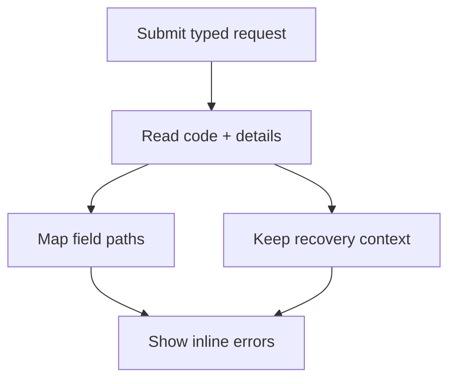

用戶端驗證可改善回饋，但授權、並行處理、唯一性、配額及目前狀態檢查仍以伺服器為準。Protoform 會將結構化 Connect 與 gRPC 錯誤對應至 3 個位置：欄位錯誤、錯誤摘要和診斷內容。

此做法遵循 [AIP-193](https://google.aip.dev/193)：使用標準狀態碼和標準 `google.rpc.*` 詳細資料，而非剖析訊息字串。Connect 會透過 [`ConnectError.findDetails()`](https://connectrpc.com/docs/web/errors/#error-details) 公開這些詳細資料。



## 提交流程

在傳送新請求前呼叫 `clearServerErrorContext()`，接著將每個捕捉到的值傳給 `setServerErrors()`。將回傳的 `unmapped` 違規項目保留在元件狀態中，如此當路徑無法附加至欄位時，就不會遺漏任何後端錯誤。

```tsx
import type { FieldViolation } from "@/lib/protobuf-provider";
import { Button } from "@/components/ui/button";
import { useState } from "react";
import { toast } from "sonner";

const [unmapped, setUnmapped] = useState<FieldViolation[]>([]);

const onSubmit = form.handleSubmit(async (values) => {
  form.clearServerErrorContext();
  setUnmapped([]);

  try {
    await saveConnector(form.createMessage(values));
  } catch (error) {
    const result = form.setServerErrors(error);
    setUnmapped(result.unmapped);

    if (!result.handled && !result.context.message) {
      toast.error("Connector not saved. Check your connection and try again.");
    }
  }
});

return (
  <form onSubmit={onSubmit}>
    <ServerErrorSummary
      context={form.serverErrorContext}
      unmapped={unmapped}
    />
    {/* Registered fields */}
    <Button disabled={form.formState.isSubmitting} type="submit">
      Save connector
    </Button>
  </form>
);
```

`setServerErrors()` 會回傳：

| 值 | 意義 |
| --- | --- |
| `handled` | 至少有 1 個 `BadRequest.FieldViolation` 對應至表單欄位時為 `true` |
| `unmapped` | 路徑無法對應的所有欄位違規項目；請全部呈現 |
| `context` | 從同一個錯誤擷取的狀態與結構化非欄位詳細資料 |

相同的 `context` 會成為 `form.serverErrorContext`。非 Connect 錯誤會產生 `handled: false`、空的 `unmapped` 陣列及空的內容。請為此情況保留可見的通用備援訊息。請勿在請求失敗後重設表單，因為使用者需要已提交的值來修正問題。

## 欄位路徑對應

當 hook schema 代表巢狀請求欄位，但後端回報的路徑是從 RPC 請求根節點開始時，請設定 `serverPathPrefix`：

```tsx
const form = useProtoForm(NotificationSchema, {
  serverPathPrefix: "notification",
});
```

| 後端欄位路徑 | 表單路徑 |
| --- | --- |
| `notification.display_name` | `displayName` |
| `notification.shipping_address.postal_code` | `shippingAddress.postalCode` |
| `notification.delivery.webhook.signing_secret_ref` | `delivery.value.signingSecretRef` |
| `notification.delivery` | `delivery` |

Protoform 會移除完全相符的前綴、巡覽 protobuf descriptor、將 protobuf `snake_case` 名稱轉換為 TypeScript `camelCase`，並將 oneof 分支扁平化至 `{oneofLocalName}.value`。它會聚焦第一個已對應的欄位，並使用 React Hook Form 錯誤類型 `server` 加入所有已對應的違規項目。通用 Protovalidate 說明會使用與用戶端驗證相同且可採取行動的文案，而空白說明則會改用 `Review this value and try again.`。

未知欄位會保留在 `unmapped` 中。使用方括號索引的 repeated 和 map 路徑（例如 `contacts[0].email`）目前也無法對應，因為對應器解析的是 descriptor 欄位區段，而非集合索引。請在摘要中顯示這些違規項目，不要將其捨棄。

## 結構化錯誤內容

`serverErrorContext` 會將使用者回饋與機器可讀的詳細資料分開：

| 詳細資料 | 擷取的值 | 建議用途 |
| --- | --- | --- |
| 狀態碼 | `code` | 選擇概略的復原路徑；記錄至日誌 |
| `LocalizedMessage` | `message`, `messageLocale` | 面向客戶的摘要文字 |
| `ErrorInfo` | `reason`, `domain`, `metadata` | 穩定的分支判斷、遙測及支援內容 |
| `RequestInfo` | `requestId` | 支援參考資料與日誌關聯 |
| `Help` | `helpLinks` | URL 驗證後的相關疑難排解動作 |
| `RetryInfo` | `retryAfterSeconds` | 重試倒數或重試動作的可用性 |
| `PreconditionFailure` | `preconditionViolations` | 說明重試前必須變更的狀態 |
| `QuotaFailure` | `quotaViolations` | 說明已用盡的配額及下一步動作 |
| `ResourceInfo` | `resource` | 在可安全揭露時識別受影響的資源 |
| `DebugInfo` | `debug` | 僅供開發日誌使用；絕不可向客戶呈現堆疊項目 |
| 未知詳細資料類型 | `unmappedDetails` | 保留其類型名稱，供備援 UI 和遙測使用，而非捨棄 |

`RequestInfo.request_id` 的優先順序高於複製到 `ErrorInfo.metadata` 的請求 ID。`LocalizedMessage` 的優先順序高於原始 Connect 訊息。若沒有本地化詳細資料，`context.message` 會改用面向開發人員的 `rawMessage`，因此只有在 API 合約保證它是安全的客戶文案時才能呈現。

絕不可依據錯誤訊息文字進行分支判斷。請依據標準狀態碼或穩定的 `ErrorInfo.reason` 與 `ErrorInfo.domain` 組合進行判斷。將 metadata 視為不受信任的資料、以允許清單限制傳送至遙測的欄位，且不得記錄密鑰或使用者提交的敏感值。

## 無障礙錯誤摘要

行內錯誤有其必要，但仍不足夠。摘要也必須包含所有未對應、前置條件及配額違規項目。請勿將 `DebugInfo` 等診斷值放入 DOM。

```tsx
import type {
  ConnectErrorContext,
  FieldViolation,
} from "@/lib/protobuf-provider";
import { Alert, AlertDescription, AlertTitle } from "@/components/ui/alert";

function getSafeHelpUrl(value: string): string | undefined {
  if (!URL.canParse(value)) {
    return;
  }
  const url = new URL(value);
  return url.protocol === "https:" ? url.href : undefined;
}

function ServerErrorSummary({
  context,
  unmapped,
}: {
  context: ConnectErrorContext | undefined;
  unmapped: FieldViolation[];
}) {
  if (!context) {
    return null;
  }

  const helpLinks = context.helpLinks.flatMap((link) => {
    const href = getSafeHelpUrl(link.url);
    return href ? [{ ...link, href }] : [];
  });
  const localizedMessage = context.messageLocale ? context.message : undefined;
  const hasSummary = Boolean(
    context.message ||
      context.requestId ||
      helpLinks.length ||
      unmapped.length ||
      context.preconditionViolations.length ||
      context.quotaViolations.length
  );

  if (!hasSummary) {
    return null;
  }

  return (
    <Alert aria-live="polite" variant="destructive">
      <AlertTitle>Connector not saved</AlertTitle>
      <AlertDescription>
        <p>
          {localizedMessage ??
            "Check the highlighted fields and the details below, then try again."}
        </p>

        {unmapped.length > 0 && (
          <ul>
            {unmapped.map((violation) => (
              <li key={`${violation.field}:${violation.description}`}>
                {violation.description || `Check ${violation.field}.`}
              </li>
            ))}
          </ul>
        )}

        {context.preconditionViolations.length > 0 && (
          <ul>
            {context.preconditionViolations.map((violation) => (
              <li key={`${violation.type}:${violation.subject}`}>
                {violation.description}
              </li>
            ))}
          </ul>
        )}

        {context.quotaViolations.length > 0 && (
          <ul>
            {context.quotaViolations.map((violation) => (
              <li key={`${violation.subject}:${violation.description}`}>
                {violation.description}
              </li>
            ))}
          </ul>
        )}

        {helpLinks.map((link) => (
          <p key={link.href}>
            <a href={link.href} rel="noreferrer" target="_blank">
              {link.description}
            </a>
          </p>
        ))}

        {context.requestId && <p>Support reference: {context.requestId}</p>}
      </AlertDescription>
    </Alert>
  );
}
```

在有錯誤的欄位上使用 `aria-invalid`，以 `aria-describedby` 將每個錯誤連結至其輸入控制項，並呈現所有訊息，而非只顯示第一則。`setServerErrors()` 會要求聚焦第一個已對應的欄位。摘要使用 `aria-live="polite"`，因此系統會宣告未對應的失敗，而不會中斷目前的欄位互動。

### Stepper 復原

當 AutoForm 使用 `stepper` 時，非同步提交可能會回報不在目前步驟中掛載的欄位。處理常式完成後，AutoForm 會檢查已提交的表單狀態、開啟第一個錯誤所屬的步驟、呈現每個欄位錯誤，接著聚焦第一個無效控制項。每個步驟的值都會保持不變。根層級與未對應的錯誤會保留在表單層級的警示中，因為沒有可安全對應的欄位位置。

這需要穩定的頂層步驟擁有權 metadata。請參閱 [Stepper](/docs/steppers)、聚焦於此主題的[伺服器錯誤表單](/docs/server-error-form)，以及整合的[複雜端對端範例](/docs/complex-example)。

## 重試決策

`RetryInfo` 是伺服器提示，不代表可重播每項 mutation。請遵循 [AIP-194](https://google.aip.dev/194)：自動重試僅適用於 unary、非交易型操作，且重複執行不得產生非預期的狀態變更。

| 代碼 | 表單復原方式 |
| --- | --- |
| `invalid_argument` | 顯示欄位與摘要錯誤；僅在值變更後重試 |
| `failed_precondition` | 顯示每項前置條件；在必要狀態變更後重試 |
| `already_exists` / `not_found` | 說明衝突或遺失的資源；不要循環重試 |
| `unauthenticated` | 重試前先恢復驗證狀態 |
| `permission_denied` | 說明允許的下一步動作，但不得揭露隱藏資源 |
| `aborted` | 重新擷取目前狀態，並讓使用者在重試交易前檢閱變更 |
| `resource_exhausted` | 顯示配額詳細資料；通常不要自動重試 |
| `unavailable` | 僅重試具冪等性的 unary 請求，並使用有界退避與 jitter |
| `deadline_exceeded` | 顯示逾時，因為操作可能已完成 |
| `internal` / `unknown` / `data_loss` | 顯示穩定的備援訊息和請求 ID；回報失敗 |
| `canceled` | 若由使用者發起取消，則安靜地停止 |

建立與更新操作不會自動具備冪等性。若 API 支援安全重播，請在請求中加入選用的 `request_id`，並遵守 [AIP-155](https://google.aip.dev/155) 的冪等性保證。同一邏輯操作的多次重試應保留相同的請求 ID。

## 伺服器合約

為確保用戶端行為可預期，API 應：

- 回傳標準 `google.rpc.Code` 值及簡短、面向開發人員的英文狀態訊息
- 附加一個 `ErrorInfo`，包含穩定的 UPPER_SNAKE_CASE reason、全域唯一的 domain 及 metadata
- 對每個無效的請求欄位使用 `BadRequest.FieldViolation` 並填入 `description`，因為目前的 Protoform 對應器會在行內呈現該值
- 使用 protobuf 請求路徑，並在適用時包含請求包裝器前綴
- 附加 `LocalizedMessage` 作為安全的客戶文案，並附加 `Help` 提供相關 HTTPS 指引
- 附加 `RequestInfo`，讓支援人員可關聯失敗，而不會公開內部偵錯資訊
- 僅在語意符合該失敗時附加 `RetryInfo`、`PreconditionFailure`、`QuotaFailure` 和 `ResourceInfo`
- 將 `DebugInfo` 限制於受信任的開發與可觀測性系統
- 先檢查權限再檢查是否存在，避免 `permission_denied` 洩露隱藏資源

Protoform 會保留這些詳細資料，但不會虛構缺少的伺服器語意。若後端只回傳非結構化字串，表單可以顯示通用備援訊息，但無法可靠地對應欄位、選擇復原動作或關聯支援請求。

## 驗證矩陣

將錯誤路徑納入表單合約測試：

- scalar、巢狀、oneof 群組和 oneof 分支違規項目會對應至預期欄位
- 僅在已設定時移除請求包裝器前綴
- 未知及使用方括號索引的路徑會顯示於摘要中
- 每個已對應及未對應的違規項目都保持可見
- 缺少說明時使用行內備援訊息
- 正確呈現本地化訊息、請求 ID、說明連結、配額及前置條件詳細資料
- 不會將不安全或相對路徑的說明 URL 呈現為連結
- 偵錯詳細資料和未經核准的 metadata 絕不會進入 DOM 或客戶遙測
- 非 Connect 錯誤會顯示可見的通用備援訊息
- 重試控制項會遵循代碼、冪等性、請求 ID 及 `RetryInfo`
- 新的提交嘗試會清除過期的 `serverErrorContext`
