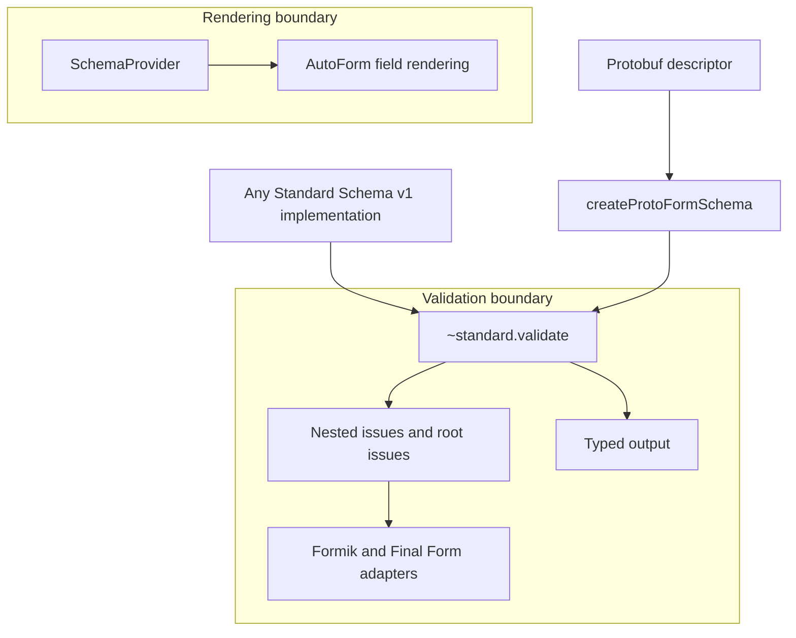

Protoform 將 [Standard Schema v1](https://standardschema.dev/schema) 視為其驗證邊界。
複製的 Protoform 核心依賴此標準，而非 Zod、Valibot、ArkType 或其他
結構描述供應商。因此，符合規範的實作可以使用相同的表單函式庫介接器，無須
供應商專屬的套件或程式碼路徑。

本頁說明支援的合約。相容性表中列出的函式庫是測試
證據，而非允許清單。

## 功能矩陣

| 功能 | 支援與行為 |
| --- | --- |
| 物件實作 | **支援。** 接受具有符合規範之 `~standard` 屬性的物件 |
| 可呼叫實作 | **支援。** 接受同時公開符合規範之 `~standard` 屬性的函式 |
| 同步驗證 | **支援。** 傳回表單錯誤，不強制使用 promise |
| 非同步驗證 | **支援。** Formik 與 Final Form 會等候其完成 |
| 巢狀問題 | **支援。** 在巢狀錯誤樹狀結構中保留字串、數字及 `{ key }` 路徑區段 |
| 根層級問題 | **支援。** 將無路徑的問題對應至表單函式庫的根層級錯誤管道 |
| 多個問題 | **支援。** 保留每個問題，並以換行合併同一欄位的訊息 |
| 型別化輸出 | **支援。** 驗證成功後可從 `~standard.validate` 取得 |
| `libraryOptions` | **支援。** 將供應商選項原封不動轉送至 `~standard.validate` |
| 自動欄位呈現 | **需要提供者。** AutoForm 需要 `SchemaProvider` 來提供欄位、預設值及 UI 中繼資料 |

## 架構邊界



Standard Schema 描述驗證輸入、型別化輸出及問題。它並未標準化欄位
探索、預設值、小工具、版面配置或 UI 註解。這些呈現相關事項保留在
`SchemaProvider` 之後，因此新增其他結構描述函式庫不會改變 Protoform 的核心架構。

## Zod 4

Zod 4 直接實作 Standard Schema。將 Zod 結構描述傳給 Protoform 介接器，無須 Zod
介接器或轉換步驟：

```tsx
import { createFormikValidator } from "@/lib/core"
import * as z from "zod"

const profileSchema = z.object({
  profile: z.object({
    displayName: z.string().min(2),
  }),
})

const validate = createFormikValidator(profileSchema)
```

Zod 僅是測試用的相容性依賴項。Protoform 核心
不會匯入它。

## Zod Mini

[Zod Mini](https://zod.dev/packages/mini) 透過其
函式式、可 tree-shake 的 API 公開相同的 Standard Schema 合約：

```tsx
import { createFormikValidator } from "@/lib/core"
import { minLength, object, string } from "zod/mini"

const profileSchema = object({
  profile: object({
    displayName: string().check(minLength(2)),
  }),
})

const validate = createFormikValidator(profileSchema)
```

Protoform 不會檢查 Zod 類別或方法。Zod 4 與 Zod Mini 和其他所有符合規範的實作一樣，
都透過相同的 `~standard.validate` 接合點。

## 介接器用法

介接器會將 Standard Schema 問題轉換成各表單函式庫的巢狀錯誤格式。它們
不負責欄位呈現或提交。

### Formik

Formik 接受同步或非同步的表單層級驗證：

```tsx
import { createFormikValidator } from "@/lib/core"

const validate = createFormikValidator(profileSchema)
```

無路徑的問題使用 `_form`。請參閱完整的 [Formik 整合](/docs/formik)。

### Final Form

將 Final Form 的 `FORM_ERROR` 符號作為根層級問題鍵傳入：

```tsx
import { createFinalFormValidator } from "@/lib/core"
import { FORM_ERROR } from "final-form"

const validate = createFinalFormValidator(profileSchema, {
  rootErrorKey: FORM_ERROR,
})
```

請參閱完整的 [Final Form 整合](/docs/final-form)。

TanStack Form 原生接受 Standard Schema。Protoform 的選用原生介面可加入 protobuf
訊息、更新遮罩、oneof 輔助工具及伺服器錯誤對應，而不會取代 TanStack API。
請參閱 [TanStack Form 整合](/docs/tanstack-form)。React Hook Form 可使用其通用
`standardSchemaResolver`；protobuf 應用程式通常應優先使用其原生 `useProtoForm`
介面，以取得 protobuf 專屬的問題對應與驗證行為。

## 型別化輸出與轉換

表單函式庫的驗證回呼會傳回錯誤，而非結構描述的成功值。當結構描述會轉換輸入或產生其他輸出型別時，
請在提交處理常式中進行驗證：

```tsx
import type { StandardSchemaV1 } from "@/lib/core"

type ProfileValues = StandardSchemaV1.InferInput<typeof profileSchema>

async function submit(values: ProfileValues) {
  const result = await profileSchema["~standard"].validate(values)
  if (result.issues) return

  await saveProfile(result.value)
}
```

`result.value` 會保留結構描述宣告的輸出型別。對於 Protoform protobuf 結構描述，它是
API 用戶端預期的產生訊息。

## 供應商函式庫選項

若實作支援額外的驗證選項，請透過介接器傳入：

```tsx
const validate = createFormikValidator(profileSchema, {
  libraryOptions: {
    locale: "en-GB",
  },
})
```

Protoform 會原封不動地轉送 `libraryOptions`，且不解讀供應商鍵。結構描述
實作仍負責定義其意義與支援方式。

## 相容性證據

| 實作 | 測試套件驗證內容 |
| --- | --- |
| Protoform protobuf 結構描述 | Standard Schema 中繼資料、驗證問題及型別化訊息輸出 |
| 可呼叫的測試固定資料 | 執行階段偵測與 `libraryOptions` 轉送 |
| Zod 4 | 直接接受，並透過每個介接器對應巢狀問題 |
| Zod Mini | 直接接受，並透過每個介接器對應巢狀問題 |

使用以下指令執行公開驗證：

```bash
bun run test:conformance -- -t "Standard Schema"
```

任何實作 Standard Schema v1 的函式庫都應使用相同的接合點。在宣稱已驗證某個具名函式庫之前，
請先新增相容性測試固定資料。
