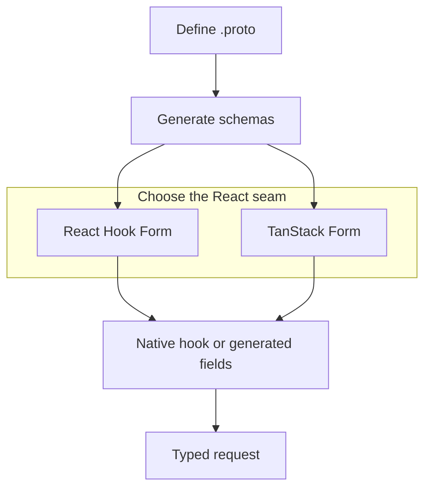

Protoform 是一套 shadcn 風格的表單 registry，以 protobuf 作為唯一真實來源。
它結合了：

- **Protovalidate**：提供跨用戶端與伺服器通用的驗證規則。
- **React Hook Form**：作為預設產生的 AutoForm 引擎，另為 **TanStack Form** 提供原生 hook 與產生的
  AutoForm。
- **Formik** 與 **Final Form** 驗證 adapter：適用於保留這些狀態 API 的應用程式。
- **CEL 運算式**：用於條件式商業規則。
- **AutoForm annotation**：根據 protobuf descriptor 產生 UI。
- **Connect/gRPC 錯誤對應**：處理伺服器端欄位違規。
- **[Standard Schema](/docs/standard-schema)**：為其他表單
  library 提供可攜式驗證介面。
- **一致性測試套件**：涵蓋 descriptor 解析、驗證、表單路徑和值轉換。
- **正式環境就緒度 profile**：衡量已驗證的涵蓋範圍，並列出所有尚待完成的測試。
- **五個聚焦功能的互動式示範中心**：涵蓋 [Protobuf](/docs/protobuf-examples)、
  [Protovalidate](/docs/protovalidate-examples)、[CEL](/docs/cel-examples)、
  [正式環境行為](/docs/production-examples)和 AIP。
- **[每個適用 AIP 的即時表單](/docs/aip-example-catalog)**：集中於單一中心，並提供
  與可執行相容性證據連結的穩定深層連結。

## 存在的理由

大多數表單技術棧從 TypeScript schema 開始，之後便逐漸偏離 API 合約。
Protoform 則從 protobuf 合約開始：message descriptor 可提供型別、
驗證、UI metadata、oneof 結構、伺服器錯誤路徑，以及未來的程式碼產生 hook。

```bash
bunx shadcn@latest add @protoform/protoform
```

## 運作方式

1. 保留應用程式既有的 React Hook Form 或 TanStack Form API。
2. 將原生 hook import 替換為相應的 `useProtoForm(schema, options)`。
3. 使用 Protovalidate annotation，避免重複撰寫前端驗證。
4. 使用 CEL 實作跨欄位邏輯。
5. 為 proto 檔案加上 annotation，以自動產生表單。
6. 將後端 `BadRequest.FieldViolation` 錯誤對應至精確欄位。
7. 使用 LLM 遷移 prompt，逐步遷移 Zod schema。
8. 使用 `bun run test:conformance` 鎖定公開行為。
9. 使用 `bun run readiness:report` 追蹤剩餘的正式環境工作。

既有的 Protobuf-ES v1 應用程式應先參閱
[v2 遷移指南](/docs/protobuf-v2-migration)；Protoform 僅接受 v2 產生的 schema。

請參閱即時[正式環境就緒度儀表板](/docs/production-readiness)，查看目前依
Protobuf、Protovalidate、CEL、Google AIP 和 runtime 領域分類的分數。


