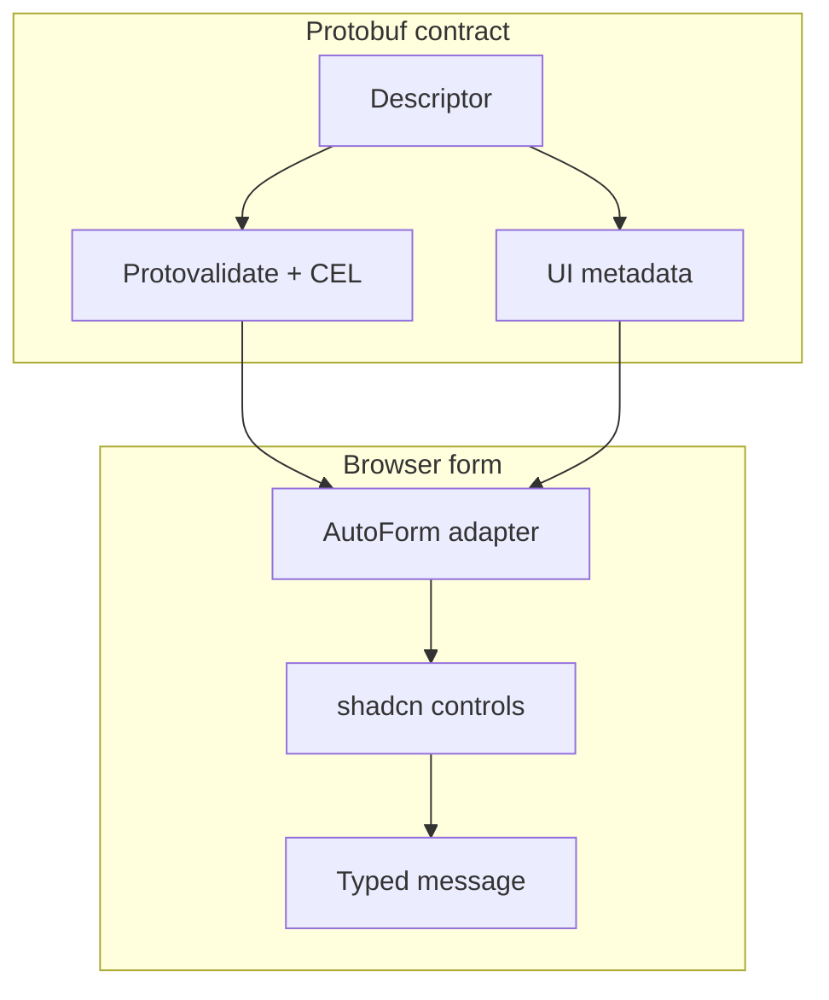

AutoForm 读取 protobuf 描述符和可选的 UI 注解来生成字段。
它适用于管理界面、设置流程、连接器配置，以及需要随 proto schema 演进的表单。

默认的 `protoform-react` registry 项使用 React Hook Form。安装 `auto-form-tanstack` 并从
`@/components/auto-form-tanstack` 导入，可继续让 TanStack Form 管理状态。两者使用相同的
renderer、字段、验证生命周期、stepper 和 protobuf 提交约定。

```tsx
import { AutoForm } from "@/components/auto-form";
import { CreateConnectorRequestSchema } from "@/gen/example/v1/connector_pb";

export function ConnectorForm() {
  return (
    <AutoForm
      schema={CreateConnectorRequestSchema}
      onSubmit={(message) => console.log(message)}
      modes={["simple", "advanced", "json"]}
    />
  );
}
```

对于 protobuf schema，`onSubmit` 的第三个参数会收到自动生成的脏字段更新掩码和 `AbortSignal`。
构造 AIP 更新请求时使用该掩码；空的 `paths` 数组表示没有任何更改。将信号传给支持中止的 transport，
以便在组件卸载或发起较新的尝试时停止过期工作：

```tsx
<AutoForm
  defaultValues={connector}
  schema={ConnectorSchema}
  withSubmit
  onSubmit={(nextConnector, _form, { signal, updateMask }) =>
    updateConnector(create(UpdateConnectorRequestSchema, {
      connector: nextConnector,
      updateMask,
    }), { signal })
  }
/>
```

自定义 `SchemaProvider.validateSchema(values, context)` 会收到相同的信号。AutoForm 会中止
被取代的步骤验证，在组件卸载时中止正在进行的验证和提交，并忽略取消后才完成的结果。

## UI 元数据示例

Protoform 支持以下注解：

- 标签和描述
- 帮助文本和文档链接
- 字段顺序和紧凑行
- 线性多步骤表单的稳定步骤归属
- 简单 / 高级可见性
- CEL 驱动的可见性和禁用状态
- 选择选项和选项组
- 自定义验证消息
- 正则表达式示例
- 禁用或条件可见性规则

```proto
message ConnectorConfig {
  string bootstrap_servers = 1 [
    (protoform.ui.field).label = "Bootstrap servers",
    (protoform.ui.field).help = "Comma-separated host:port list",
    (protoform.ui.field).step = "connection"
  ];
}
```

通过 `stepper={{ steps }}` 传入有序步骤定义。AutoForm 在继续时只验证当前
步骤，在提交时验证完整请求，并将结构化字段错误返回到其所属步骤。
请参阅 [步骤导航](/docs/steppers)。

## Oneof 支持

Oneof 会被扁平化以供表单使用，同时仍会创建有效的 protobuf 消息：

```tsx
form.setOneofValue("auth", "sasl", { username: "", password: "" });
```

## 自定义字段 renderer

当宿主需要未内置的控件时，可扩展类型化 registry。自定义名称会贯穿
`fieldConfig`、registry、嵌套字段、分类以及两个表单 adapter，且无需
类型断言。如果配置指定了没有对应组件的 renderer，AutoForm 会显示字段级
配置错误，而不会崩溃。

```tsx
import {
  AutoForm,
  defaultRegistry,
  type AutoFormFieldProps,
} from "@/components/auto-form";
import { Textarea as CodeEditor } from "@/components/ui/textarea";

function CodeField({ id, inputProps }: AutoFormFieldProps) {
  const { onValueChange, testId, value, ...controlProps } = inputProps;
  return (
    <CodeEditor
      {...controlProps}
      data-testid={testId}
      id={id}
      value={String(value ?? "")}
      onChange={(event) => onValueChange(event.target.value)}
    />
  );
}

const registry = defaultRegistry.clone().register({
  name: "code",
  priority: 100,
  match: (field) => field.key === "source",
  component: CodeField,
});

<AutoForm
  schema={schema}
  fieldRegistry={registry}
  formComponents={{ code: CodeField }}
  fieldConfig={{ "settings.source": { fieldType: "code" } }}
/>;
```

## 重复字符串

默认情况下，protobuf 转换会丢弃重复字符串字段中的空条目和仅含空白的条目。
其他重复标量、枚举、bytes 和消息字段保持不变。可通过字段的描述符路径为特定字段保留空行：

```tsx
<AutoForm
  schema={RequestSchema}
  fieldConfig={{ aliases: { emptyRepeatedStringPolicy: "preserve" } }}
/>;

useProtoForm(RequestSchema, {
  emptyRepeatedStringPolicies: { "settings.aliases": "preserve" },
});
```

嵌套消息和 oneof 消息路径使用点号表示法。

## 脏状态生命周期

`onDirtyChange` 会报告初始的 `false` 状态以及每次不同的状态转换。它涵盖标量、
嵌套、数组、map 和 oneof 更改。恢复到干净基线后会再次报告 `false`。成功保存后，
请先将提交的值设为新基线，再执行导航：

```tsx
<AutoForm
  schema={RequestSchema}
  onDirtyChange={setHasUnsavedChanges}
  onSubmit={async (message, _nativeForm, { form }) => {
    await save(message);
    form.markClean();
    navigate({ to: "/resources" });
  }}
/>;
```

`markClean()` 会同步更新回调，因此路由拦截器可在同一个提交回调中观察到干净状态。

## 根标题和弃用字段

默认渲染 schema 提供的根标题和描述。使用 `rootHeader="hidden"` 可将其省略，
或使用 `renderRootHeader={(metadata) => ...}` 在宿主管理的 shell 中渲染。

protobuf 描述符中标记为弃用的字段默认仍然可见。设置
`deprecatedFields="disable"` 可禁止编辑，设置 `deprecatedFields="hide"` 可将其省略，
这也适用于嵌套字段和 oneof 选项。隐藏和禁用的值仍会保留在表单 payload 中，
因此编辑较新的字段不会悄然删除现有数据。

## 服务端字段错误

两个 protobuf 表单 hook 都会将服务端字段路径映射到对应控件，将通用约束
描述转换为易读文本，在 adapter 支持时聚焦第一个已映射字段，并保留未映射的
违规信息，以供摘要或 toast 处理。服务端描述为空时，使用可操作的回退消息
“请检查此值，然后重试。”错误详情上下文仍可通过 `serverErrorContext` 获取。


## shadcn 原生控件覆盖范围

AutoForm 将 protobuf 注解和字段配置解析为源码自有的 UI 组件。默认
registry 项会将其运行时和这些渲染目标复制到你的应用中：

| 注解 / 配置 | shadcn 风格控件 |
| --- | --- |
| `CONTROL_TYPE_TEXT`, `email`, `url`, `password` | `Input` |
| `CONTROL_TYPE_TEXTAREA` | `Textarea` |
| `CONTROL_TYPE_CHECKBOX`, `SWITCH`, `TOGGLE` | `Checkbox`, `Switch`, `Toggle` |
| `CONTROL_TYPE_RADIO_GROUP`, `SELECT`, `COMBOBOX`, `MULTI_SELECT` | `RadioGroup`, `Select`, `Command`, `Popover`, `Badge` |
| `CONTROL_TYPE_DATE`, `TIMESTAMP` | `Calendar`, `Popover`, `InputGroup` |
| `CONTROL_TYPE_JSON`, `KEY_VALUE`, `SLIDER` | 专用的 shadcn 风格字段组件 |



覆盖清单现在会跟踪每个内置的 shadcn Base UI 组件。数据输入 primitive 直接根据 proto 注解渲染；
显示和 shell primitive 可用于 AutoForm 组合、摘要、slot、帮助、加载和模式 UI，无需依赖 Radix。

### 完整的内置组件覆盖范围

| 组件角色 | 组件 |
| --- | --- |
| 直接字段控件 | `Input`, `Textarea`, `Checkbox`, `Switch`, `Toggle`, `RadioGroup`, `Select`, `Combobox`, `MultiSelect`, `Calendar`, `Slider`, `JsonField`, `KeyValueField`, `Tags`, `ToggleGroup`, `Choicebox` |
| 字段组合 | `Button`, `Badge`, `InputGroup`, `Popover`, `Command`, `Collapsible`, `Dialog` |
| 表单 shell 和状态 | `Field`, `Group`, `Label`, `Tooltip`, `Tabs`, `Spinner`, `Typography`, `Alert` |
| 仅用于显示/演示的 primitive | `Card`, `Separator`, `CopyButton` |

该清单位于 `shadcn-controls.ts` 中并经过测试，因此添加新的内置 shadcn 组件时，
必须确定它属于可由 proto 渲染的字段、字段组合、表单 shell，还是仅用于显示的 primitive。
