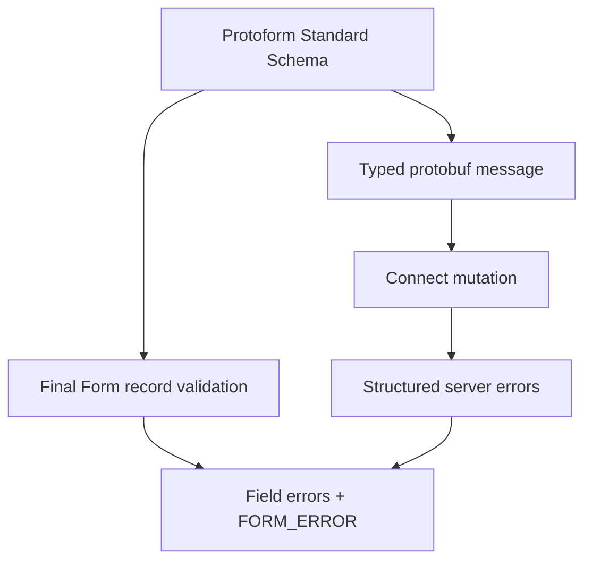

Protoform 将 protobuf 验证公开为 Standard Schema，并将其问题适配到 Final Form 的
整条记录验证约定。表单仍由手动构建，而验证和类型化提交
继续由生成的 protobuf 描述符提供。

```bash
bun add final-form react-final-form
bunx shadcn@latest add @protoform/protoform-core @protoform/protobuf-provider
```

## 实时示例

此表单使用生成的请求描述符、本地 TypeScript API、客户端验证、类型化
protobuf 提交和结构化服务器错误。留空提交即可查看描述符验证。使用
`ada@blocked.example` 可查看返回到电子邮件字段的服务器违规信息。

<div className="my-8 rounded-2xl border p-6">
  <FinalFormExample />
</div>

## 创建共享 schema

```tsx
import { createProtoFormSchema } from "@/lib/protobuf-provider"

interface ProfileValues {
  displayName: string
  email: string
}

const schema = createProtoFormSchema<
  ProfileValues,
  typeof SubmitProfileRequestSchema
>(SubmitProfileRequestSchema)
```

## 使用 Final Form 进行验证

React Final Form 接受返回错误对象或 promise 的记录验证。传入其
`FORM_ERROR` 键，使根级问题使用框架的表单级错误通道。

```tsx
import { createFinalFormValidator } from "@/lib/core"
import { FORM_ERROR } from "final-form"
import { Form } from "react-final-form"

const validate = createFinalFormValidator(schema, {
  rootErrorKey: FORM_ERROR,
})

<Form
  initialValues={{ displayName: "", email: "" }}
  validate={validate}
  onSubmit={async (values) => {
    const result = await schema["~standard"].validate(values)
    if (result.issues) return { [FORM_ERROR]: "Review the form." }

    try {
      await client.submitProfile(result.value)
    } catch (error) {
      return mapStructuredServerErrors(error, FORM_ERROR)
    }
  }}
>
  {({ handleSubmit }) => <form onSubmit={handleSubmit}>{/* fields */}</form>}
</Form>
```

在提交处理程序中执行验证，以获得生成的类型化 protobuf 消息。验证
适配器本身会返回 Final Form 所需的嵌套错误。

## 提交错误

Final Form 要求预期内的提交失败通过错误对象正常返回。仅将 promise
拒绝用于传输或编程错误。从 `onSubmit` 返回映射后的结构化服务器错误，
渲染 `submitError`，并聚焦第一个包含服务器违规信息的字段。

渲染所有根级和字段消息，保留已输入的值，并在无效
输入上设置 `aria-invalid`。应使用 `extractFieldViolations` 和
`protoPathToFormPath` 转换 Protobuf 路径；未映射的失败仍需在表单级别显示。



有关记录验证和提交语义，请参阅 [React Final Form `Form` 约定](https://final-form.org/docs/react-final-form/types/FormProps)。
生成的 AutoForm 适配器目前面向 React Hook Form 和 TanStack Form。对于现有的手动构建
Final Form，请使用此适配器。
