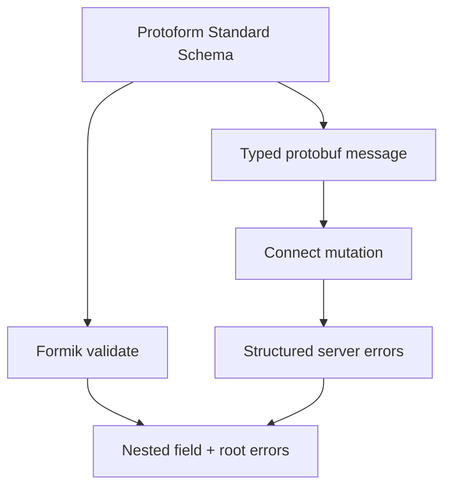

Protoform 将 Formik 连接到所有其他集成共用的 Standard Schema。该适配器会将每个验证问题映射到 Formik 的嵌套错误对象，同时仍以 protobuf 作为验证和提交契约。

```bash
bun add formik
bunx shadcn@latest add @protoform/protoform-core @protoform/protobuf-provider
```

## 实时示例

此表单使用生成的请求描述符、本地 TypeScript API、客户端验证、类型化 protobuf 提交和结构化服务器错误。直接提交空表单可查看描述符验证。使用 `ada@blocked.example` 可查看服务器违规信息返回到电子邮件字段。

<div className="my-8 rounded-2xl border p-6">
  <FormikExample />
</div>

## 创建共享 schema

```tsx
import { createProtoFormSchema } from "@/lib/protobuf-provider"

interface ProfileValues {
  displayName: string
  email: string
}

const schema = createProtoFormSchema<
  ProfileValues,
  typeof SubmitProfileRequestSchema
>(SubmitProfileRequestSchema)
```

## 使用 Formik 验证

Formik 接受同步或异步的表单级 `validate` 函数。将 `createFormikValidator(schema)` 传给 `validate`，而不是 `validationSchema`；后者需要特定于库的 schema 接口。

```tsx
import { createFormikValidator } from "@/lib/core"
import { Formik } from "formik"

const validate = createFormikValidator(schema)

<Formik
  initialValues={{ displayName: "", email: "" }}
  validate={validate}
  onSubmit={async (values, helpers) => {
    const result = await schema["~standard"].validate(values)
    if (result.issues) return

    try {
      await client.submitProfile(result.value)
    } catch (error) {
      helpers.setErrors(mapStructuredServerErrors(error))
    }
  }}
>
  {({ handleSubmit }) => <form onSubmit={handleSubmit}>{/* fields */}</form>}
</Formik>
```

验证适配器仅返回与表单结构一致的错误。在提交处理程序中执行验证，以获取 schema 转换后的输出，包括生成的类型化 protobuf 消息。

## 根级错误和服务器错误

根级验证问题默认使用 `_form`。在可见的警告框中呈现每条根级消息。使用 `extractFieldViolations` 和 `protoPathToFormPath` 映射来自 protobuf 路径的结构化服务器错误，调用 `setErrors`，并聚焦第一个已映射字段。对于未映射的传输和服务器故障，应将其保留在表单级警告框中，而不是静默忽略。

同一字段的多个问题以换行符分隔。呈现时将其拆分，确保每个失败信息都可见，并在对应输入框上设置 `aria-invalid`。



有关 Formik 的验证生命周期，请参阅 [Formik 验证指南](https://formik.org/docs/guides/validation)。生成的 AutoForm 适配器目前面向 React Hook Form 和 TanStack Form。对于现有的手工构建 Formik 表单，请使用此适配器。
