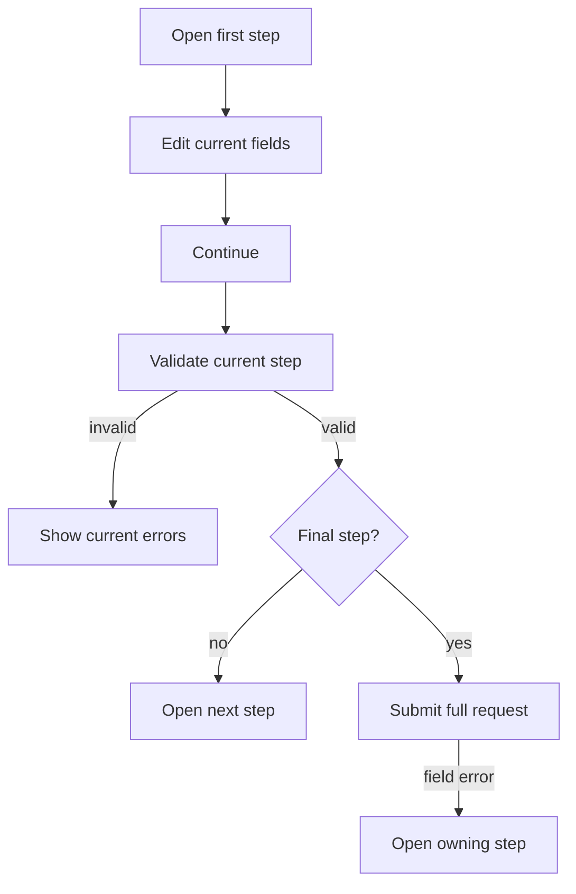

Protoform 的步骤表单是一种可选的 AutoForm 展示模式。它围绕语义化导航地标和有序列表，使用源码自有的 shadcn `Button`
和排版原语。shadcn 并未在其[组件目录](https://ui.shadcn.com/docs/components)
中发布原生 Stepper 组件，因此该实现遵循成熟的多页面表单和步骤指示器指南，而不是
改用 Tabs。

Tabs 可按任意顺序切换同级面板。表单步骤是一项线性任务，包含当前步骤验证、
返回和继续操作，以及最终的提交操作。这一区别符合
[W3C 多页面表单模式](https://www.w3.org/WAI/tutorials/forms/multi-page/)和
[USWDS 步骤指示器指南](https://designsystem.digital.gov/components/step-indicator/)。

## 建议：自行维护组合实现

保留现有的注册表实现。不要添加步骤状态库或通用 Stepper
依赖项。表单已经管理值、验证、提交和服务器错误；再添加一个
状态机会增加同步工作，却无法改善 UI。

使用 shadcn 原语组合此模式：

- 使用 `Button` 实现返回、继续和提交。
- 使用排版 token 设置步骤名称和描述。
- 使用原生 `<nav>` 和 `<ol>` 表达进度语义。
- 使用响应式水平标签：空间变窄时标签移至编号下方，并在有序列表
  即将需要换行前隐藏。
- 对较长的步骤名称，可使用垂直步骤栏。
- 在表单已有的相应位置使用 `Separator`、`Field` 和 `Alert`；它们都不管理导航状态。

最小的源码自有指示器仅使用普通 React 和 HTML：

```tsx
<nav aria-label="Form progress">
  <ol>
    {steps.map((step, index) => (
      <li
        aria-current={index === currentStepIndex ? "step" : undefined}
        key={step.id}
      >
        <span>{index + 1}</span>
        <span>{step.title}</span>
      </li>
    ))}
  </ol>
</nav>
```

不要使用 Tabs、Breadcrumb、Carousel 或一排可点击按钮来替代。Tabs 表示同级视图，
Breadcrumb 描述位置，Carousel 用于浏览内容，而直接使用步骤按钮会让用户绕过
表单的验证约定。如果产品以后允许非线性导航，应通过测试将其定义为
明确的 AutoForm 策略，而不是更改指示器的语义。

## 配置步骤

```tsx
const steps = [
  { id: "basics", title: "Basics", description: "Name the resource." },
  { id: "runtime", title: "Runtime", description: "Choose capacity." },
  { id: "review", title: "Review", description: "Confirm and submit." },
];

<AutoForm
  schema={CreateEnvironmentRequestSchema}
  stepper={{ steps, defaultStep: "basics" }}
  withSubmit
/>
```

默认使用水平方向。它保持单行，并适应可用宽度：狭窄
容器仅显示编号，中等宽度容器将标签置于编号下方，宽
容器则将标签与编号排列在同一行。

当步骤名称需要更多空间时，使用垂直步骤栏：

```tsx
<AutoForm
  schema={CreateEnvironmentRequestSchema}
  stepper={{ steps, orientation: "vertical" }}
  withSubmit
/>
```

在较宽屏幕上，垂直步骤栏位于活动面板旁边；在狭窄
屏幕上，则移至面板上方。两种方向都保留相同的有序列表语义和线性验证行为。

`stepper` 要求至少有 2 个步骤，且 ID 必须非空且唯一。ID 是有序
React 配置与 protobuf UI 元数据之间的约定：

```proto
message CreateEnvironmentRequest {
  string display_name = 1 [
    (protoform.v1.field_ui).step = "basics"
  ];

  oneof credentials {
    option (protoform.v1.oneof_ui).step = "runtime";
    ApiKeyCredentials api_key = 2;
    ServiceAccountCredentials service_account = 3;
  }
}
```

未标注的字段和未知步骤 ID 会回退到第一个步骤，确保 schema 演进不会隐藏
新的请求数据。目前，步骤归属仅适用于顶层字段和 oneof。

当步骤表单启用 `showSummary` 时，Protoform 会将摘要隐藏到最后
一步。这能保持流程专注，同时仍让用户在提交前完整检查内容。

## 交互约定



| 操作 | 行为 |
| --- | --- |
| 返回 | 取消待处理的步骤验证，返回上一步，并保留值 |
| 继续 | 验证当前步骤；异步验证运行时禁用 |
| 提交 | 验证完整请求；mutation 运行时禁用 |
| 服务器字段错误 | 打开该字段所属的步骤，显示错误，并聚焦该字段 |
| 根级或未映射错误 | 停留在当前步骤并显示表单级警告 |

基于 resolver 的表单会验证完整请求，使根级不变式可以阻止继续，
然后仅保留根级问题和当前步骤的问题。基于 provider 的表单只验证一次，并应用相同的
当前步骤筛选。protobuf resolver 在保留 protobuf
特定路径、oneof 规范化和类型化消息输出的同时，继续兼容 Standard Schema v1。

## 无障碍

- 进度指示器为 `<nav aria-label="Form progress"><ol>…</ol></nav>`。
- 当前列表项具有 `aria-current="step"`；已完成状态包含供屏幕阅读器读取的文本。
- `Step X of Y` 使用礼貌级别的实时区域。
- 每个面板都是带标签的 section，并遵循 DOM 顺序。
- 操作使用真正的按钮，提供可见的焦点样式，且点击目标尺寸至少达到注册表的标准大小。
- 错误字段使用 `aria-invalid` 和 `aria-describedby`；提交错误会将焦点移回第一个
  需要处理的字段。
- 进度信息不只通过颜色传达。

步骤标题应简短；仅当任务具有稳定的高层阶段时才使用 3 个或更多步骤；用户填写表单时不要
更改有序步骤列表。条件字段应置于稳定的步骤内。对于简短表单，应渲染普通的单页面 AutoForm。

从[两步表单](/docs/two-step-form)开始，然后参考
[复杂的端到端示例](/docs/complex-example)了解组合工作流，并参考
[综合示例](/docs/kitchen-sink)了解覆盖范围最广的五步约定。
