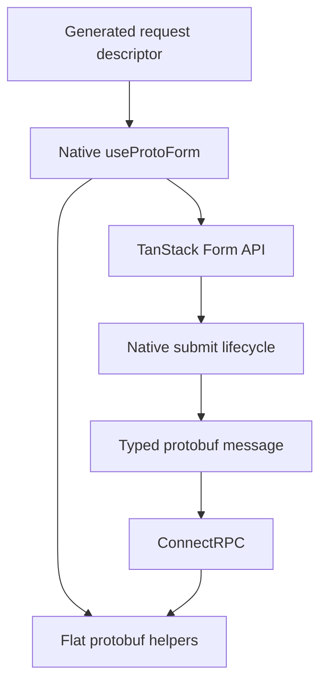

Protoform 继续使用 TanStack Form 管理表单状态。原生 `Field`、`Subscribe`、store、验证器、监听器和提交 API 均保持可用。Protoform 在同一个表单对象上添加 protobuf 转换、更新掩码、oneof 更新以及 Connect/gRPC 字段错误处理。

## 安装原生 hook

```bash
bunx shadcn@latest add @protoform/use-proto-form-tanstack
```

迁移从更改 import 开始：

```diff
- import { useForm } from "@tanstack/react-form";
+ import { useProtoForm } from "@/hooks/use-proto-form-tanstack";
```

在现有 TanStack 选项之前传入 protobuf 描述符：

```tsx
import { Button } from "@/components/ui/button";
import { Field, FieldError, FieldLabel } from "@/components/ui/field";
import { Input } from "@/components/ui/input";
import { useProtoForm } from "@/hooks/use-proto-form-tanstack";
import { SignupRequestSchema } from "@/gen/example/v1/signup_pb";

export function SignupForm() {
  const form = useProtoForm(SignupRequestSchema, {
    defaultValues: { email: "", displayName: "" },
    validators: {
      onChange: ({ value }) =>
        value.email.endsWith("@example.com")
          ? undefined
          : { fields: { email: "Use your example.com address." } },
    },
    onSubmit: async ({ value }) => {
      await client.signup(form.createMessage(value));
    },
  });

  return (
    <form
      onSubmit={(event) => {
        event.preventDefault();
        event.stopPropagation();
        form.handleSubmit().catch(reportSubmissionError);
      }}
    >
      <form.Field name="email">
        {(field) => (
          <Field data-invalid={!field.state.meta.isValid}>
            <FieldLabel htmlFor={field.name}>Email</FieldLabel>
            <Input
              aria-invalid={!field.state.meta.isValid}
              id={field.name}
              name={field.name}
              onBlur={field.handleBlur}
              onChange={(event) => field.handleChange(event.target.value)}
              type="email"
              value={field.state.value}
            />
            {!field.state.meta.isValid ? (
              <FieldError>{field.state.meta.errors.join("\n")}</FieldError>
            ) : null}
          </Field>
        )}
      </form.Field>
      <Button type="submit">Create account</Button>
    </form>
  );
}
```

该 hook 将 protobuf 验证与现有的同步和异步提交验证器组合使用，而不是替换它们。

<div className="my-8 border-y border-border/60 py-8">
  <TanStackFormExample />
</div>

提交空表单，可在原生 TanStack 字段元数据中查看 protobuf 问题。使用 `ada@blocked.example`，可查看 `setServerErrors` 如何将结构化服务器违规信息映射回 email 字段。



## 扁平 Protoform 辅助方法

返回值是完整的 TanStack 表单 API，并包含以下扩展：

- `createMessage(values?)` 将表单值转换为 protobuf 消息。
- `createUpdateMask()` 返回已修改且可写的 protobuf 路径。
- `setOneofValue(path, case, value)` 更改 oneof，且不保留之前的分支。
- `setServerErrors(error)` 将结构化 Connect/gRPC 字段违规信息映射到 TanStack 字段元数据。
- `getNestedErrors(path)` 读取嵌套对象下的字段错误。
- `serverErrorContext` 和 `clearServerErrorContext()` 提供未映射的服务器错误详情。

## 生成表单

当需要根据描述符渲染字段时，请安装 TanStack AutoForm：

```bash
bunx shadcn@latest add @protoform/auto-form-tanstack
```

```tsx
import { AutoForm } from "@/components/auto-form-tanstack";
import { SignupRequestSchema } from "@/gen/example/v1/signup_pb";

export function SignupForm() {
  return (
    <AutoForm
      schema={SignupRequestSchema}
      validationMode="blur"
      revalidationMode="change"
      formOptions={{
        listeners: {
          onChange: ({ fieldApi }) => console.log(fieldApi.name),
        },
      }}
      onFormInit={(form) => {
        // Native TanStack API, including Field, Subscribe, and store.
        console.log(form.state.values);
      }}
      onSubmit={async (message, form, { updateMask, signal }) => {
        await client.signup(message, { signal });
        console.log(form.state.isSubmitted, updateMask?.paths);
      }}
      withSubmit
    />
  );
}
```

`formOptions` 会传递给 TanStack Form。`onFormInit`、`onFieldChange` 和 `onSubmit` 会接收原生 TanStack 表单实例，因此不常见的原生用例无需 Protoform 提供替代 API。

## 共享的 AutoForm 生命周期

两个 AutoForm 引擎接受相同的生命周期属性：

| 属性 | 可选值 | 默认值 |
| --- | --- | --- |
| `validationMode` | `"submit"`、`"blur"`、`"change"` | `"submit"` |
| `revalidationMode` | `"blur"`、`"change"` | `"change"` |

生成字段、数组、map、对象、oneof、分步表单、无障碍支持以及 protobuf 提交约定与默认的 React Hook Form AutoForm 共享。表单状态和原生扩展入口仍由 TanStack Form 管理。

## 选择方案

| 起点 | 使用 |
| --- | --- |
| 现有 TanStack 字段和状态 | `use-proto-form-tanstack` |
| 由描述符驱动的生成字段 | `auto-form-tanstack` |
| React 之外的验证 | `createProtoFormSchema` |
| 现有 React Hook Form 代码 | 默认的 [`useProtoForm` 和 `auto-form`](/docs/react-hook-form) |

Formik 和 Final Form 继续使用各自较小的验证适配器。Protoform 不会封装它们的状态 API，也不宣称它们与生成式 AutoForm 功能对等。
