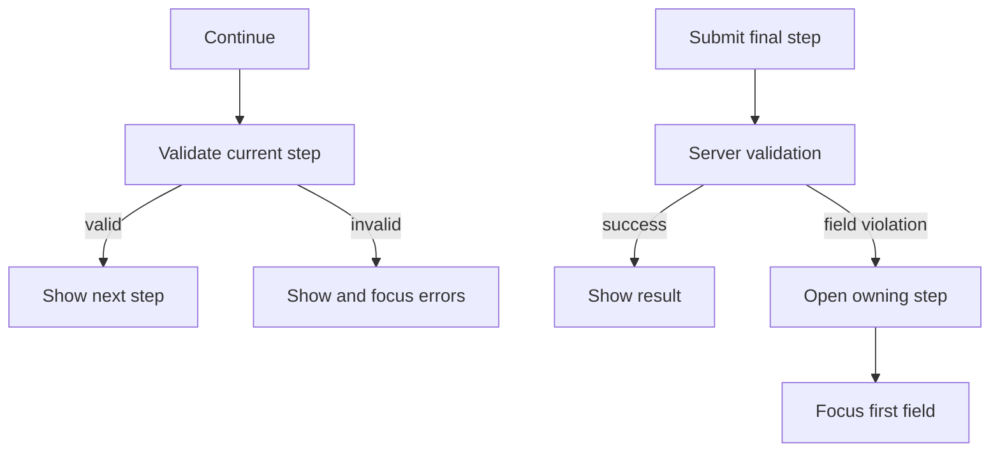

这个复杂示例使用与服务器错误表单相同的 TypeScript 服务器。该请求增加了 4 个稳定步骤、一个凭据 oneof、一份经过脱敏的审查摘要，以及一条在字段需要处理时将用户带回该字段的业务规则。

```bash
bun run examples:generate
bun run examples:dev
```

<div className="my-8 border-y border-border/60 py-8">
  <ComplexFormExample />
</div>

## 稳定的步骤元数据

顶层字段和 oneof 通过展示元数据选择加入某个步骤：

```proto
message SubmitComplexFormRequest {
  string project_id = 1 [
    (buf.validate.field).required = true,
    (protoform.v1.field_ui).step = "project"
  ];

  oneof credentials {
    option (buf.validate.oneof).required = true;
    option (protoform.v1.oneof_ui).step = "access";

    ApiKeyCredentials api_key = 6;
    ServiceAccountCredentials service_account = 7;
  }
}
```

组件提供有序的标签和描述：

```tsx
const steps = [
  { id: "project", title: "Project" },
  { id: "runtime", title: "Runtime" },
  { id: "access", title: "Access" },
  { id: "review", title: "Review" },
];

<AutoForm
  schema={SubmitComplexFormRequestSchema}
  stepper={{ steps }}
  showSummary
  renderSummary={renderRedactedSummary}
  withSubmit
/>
```

## 验证与恢复



- **返回**从不验证或丢弃值。
- **继续**仅验证属于当前步骤的字段。
- **提交**验证完整请求，并阻止重复提交。
- 结构化字段违规会打开其所属步骤、保留所有值、渲染 `aria-invalid`，并聚焦第一个无效字段。
- 网络故障和非结构化故障会继续显示在表单根部。

## Oneof 状态

切换凭据时使用 protobuf oneof 结构，因此只有当前分支能够发送到服务器。之前的分支会被清除，而不会变成幽灵数据。审查摘要特意只在最后一步显示，并对演示 API key 进行脱敏；生产环境中的摘要必须对每个敏感字段应用相同规则。

## API 设计边界

`SubmitComplexForm` 演示的是工作流请求，而不是面向资源的标准方法。对于资源 API，应在其标准 protobuf 请求结构中保留 `parent`、`{resource}_id`、资源消息、更新掩码、etag、分页、过滤器和长时间运行操作语义。表单仍可使用步骤，而无需更改该 API 契约。

有关可复用规则，请参阅[步骤器](/docs/steppers)、[服务器错误](/docs/server-errors)和 [Google AIP 与 protobuf 设计](/docs/aip-protobuf)。
