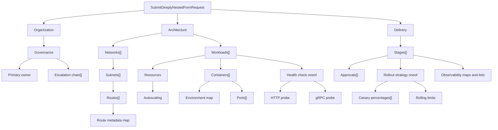

**第 3 级，共 8 级**

**前置条件：**[两步表单](/docs/two-step-form)

这个示例特意设计得很复杂，难以使用手工构建的表单渲染器实现。请求包含六层
消息嵌套、重复消息内的重复消息、多个深度的映射、两个嵌套
oneof、有界数值字段、电子邮件和 URI 控件，以及最终的动态 `Struct` 叶节点。

实时 UI 仍由一个 AutoForm 生成：

```tsx
export function DeeplyNestedFormExample() {
  return (
    <AutoForm<SubmitDeeplyNestedFormRequest>
      defaultValues={defaultValues}
      schema={SubmitDeeplyNestedFormRequestSchema}
    />
  );
}
```

`defaultValues` 很长，因为它包含一个实际的蓝图，但表单定义并不长。示例组件中
没有组件分支、递归渲染器配置、集合控制器、oneof 状态机，
也没有手动组装的验证路径。

<div className="my-8 border-y border-border/60 py-8">
  <DeeplyNestedFormExample />
</div>

## 新增内容

- 六层嵌套消息。
- 多个深度的重复消息和映射。
- 带索引验证路径的嵌套 oneof。

与后面的全功能示例不同，本级重点是描述符深度，而不是跨字段策略。

## 描述符树



最长的已渲染集合路径是
`architecture.networks[0].subnets[0].routes[0].metadata`。Protoform 从
描述符派生该路径，并在添加/删除操作、验证、表单状态和 protobuf
转换过程中保持该路径不变。

## Protoform 负责的内容

| 复杂问题 | 描述符驱动的行为 |
| --- | --- |
| 嵌套分区 | 消息描述符转换为语义化的标题层级和分区 |
| 消息集合 | 重复字段获得稳定的行、添加/删除操作、默认值和带索引的路径 |
| 行内深层映射 | 映射条目转换为键/值控件，并转换回 protobuf 映射 |
| 嵌套 oneof | 选择器管理当前分支，并在切换时清除上一个分支 |
| 约束 | Protovalidate 的必填规则、模式、范围、映射限制和重复字段限制转换为表单错误 |
| 类型化输出 | 提交生成 `SubmitDeeplyNestedFormRequest`，而不是临时拼凑的 JSON 近似对象 |

关键边界是 protobuf 契约。将字段移至更深层级、添加另一个重复
消息或引入新的 oneof 分支，只会更改描述符和重新生成的类型；React
调用点保持不变。

## 添加提交功能，无需添加字段代码

渲染示例仅在本地运行。实际应用可以在现有表单
边界添加 mutation，而无需重写嵌套 UI：

```tsx
<AutoForm<SubmitDeeplyNestedFormRequest>
  defaultValues={defaultValues}
  onSubmit={saveBlueprint}
  schema={SubmitDeeplyNestedFormRequestSchema}
  withSubmit
/>
```

当顶层分组代表稳定的用户工作流时，请使用[分步表单](/docs/steppers)。当专业用户需要浏览并比较整个层次结构时，请保持
单页布局。参阅[全功能示例](/docs/kitchen-sink)，了解如何将相同的描述符优先方法应用于最全面的 CEL。

**下一步：**[CEL 和 RE2 表单](/docs/cel-re2-form)
