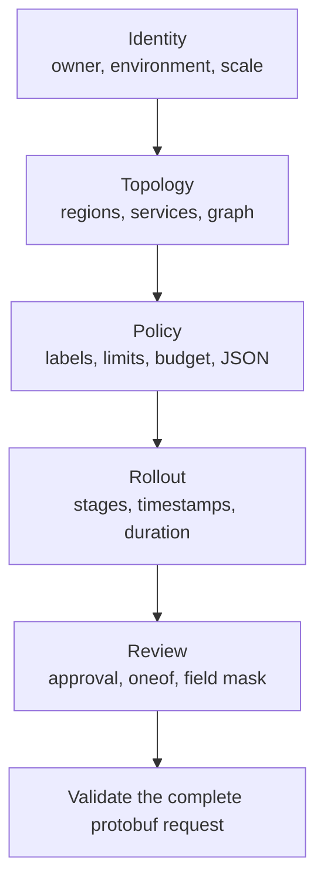

**第 8 级，共 8 级**

**前置条件：** [AIP 资源表单](/docs/aip-resource-form)

此示例刻意组合了通常分布在不同表单中的功能。它是一个可执行的
压力测试用例，并不建议将所有业务规则都放入一个请求中。同一个 protobuf v2
描述符驱动字段、浏览器验证、类型化载荷、条件式 UI、审核摘要和
五步流程。

<div className="my-8 border-y border-border/60 py-8">
  <KitchenSinkExample />
</div>

## 新增内容

不应先从这里学习任何内容。这个收官示例组合了前面各级的功能，以证明它们的
契约仍能在一个大型请求中协同工作。

## 请求涵盖的功能

| 领域 | 功能 |
| --- | --- |
| Protobuf v2 | 标量、`uint64`、枚举、可选字段存在性、重复消息、映射、oneof、`Timestamp`、`Duration`、`Struct` 和 `FieldMask` |
| Protovalidate | 必填值、范围、唯一性、映射键/值规则、URI 和电子邮件规则，以及消息 CEL |
| CEL | 嵌套推导式、成员关系、映射索引、存在性、正则表达式、时间戳运算、时长比较、数值转换、条件表达式和动态错误文本 |
| UI | 单选组、开关、复选框、URL、货币、JSON、条件显示、审核摘要和源代码自有步骤 |
| 表单行为 | 无损 64 位值、当前步骤验证、值保留、完整请求提交和可见的根级错误 |

实时表单以一个已知有效的生产部署作为初始值。更改服务名称、区域、
依赖项、预算、发布阶段或通知路由，使契约在其公开
验证边界处失败。



## 跨集合图完整性

`kitchen_sink.graph.integrity` 将重复消息和映射视为一个部署图。它验证
服务名称唯一、每个区域均被使用、依赖项存在、服务不依赖
自身、不存在两个服务间的直接循环、速率限制键对应真实服务，并且每个公开
服务都有足够的容量。

```js CEL
this.services.size() >= 2 &&
this.services.all(service,
  this.regions.exists(region,
    region == service.primary_region
  ) &&
  this.services.filter(candidate,
    candidate.name == service.name
  ).size() == 1 &&
  (!service.public_endpoint || service.health_path.startsWith('/')) &&
  service.dependencies.all(dependency,
    dependency != service.name &&
    this.services.exists(candidate,
      candidate.name == dependency
    )
  )
) &&
!this.services.exists(service,
  service.dependencies.exists(dependency,
    this.services.exists(candidate,
      candidate.name == dependency &&
      candidate.dependencies.exists(back,
        back == service.name
      )
    )
  )
) &&
this.regions.all(region,
  this.services.exists(service,
    service.primary_region == region
  )
) &&
this.rate_limits.all(name,
  this.services.exists(service,
    service.name == name
  )
) &&
this.services.filter(service,
  service.public_endpoint
).all(service,
  service.name in this.rate_limits &&
  this.rate_limits[service.name] >= 100
)
```

CEL 不是图数据库：此规则刻意只检测直接循环。如果需要检测任意深度的
循环，应在有界的后端算法中强制执行，并返回结构化字段违规信息，而不要
尝试让 CEL 递归。

## 跨字段、映射和存在性的生产策略

`kitchen_sink.production.policy` 仅适用于生产环境枚举值。它通过 `has(` 组合可选字段
存在性、重复消息谓词、映射成员关系和索引、正则
表达式，以及受限的分类词汇表。

```js CEL
this.environment != 3 || (
  this.regions.size() >= 2 &&
  this.acknowledge_risk &&
  has(this.approval_ticket) &&
  this.approval_ticket.matches('^CHG-[0-9]{6}$') &&
  this.services.all(service,
    service.replicas >= 3
  ) &&
  'owner' in this.labels &&
  this.labels['owner'].matches('^[a-z][a-z0-9-]+$') &&
  (
    !('data-classification' in this.labels) ||
    this.labels['data-classification'] in [
      'public',
      'internal',
      'restricted'
    ]
  )
)
```

## 数值和时间范围

预算规则先使用 `double()` 转换整数副本数，再将每项服务与
浮点预算的均等份额进行比较：

```js CEL
this.services.size() == 0 ||
this.services.all(service,
  double(service.replicas) * service.monthly_cost_per_replica <=
  this.monthly_budget / double(this.services.size())
)
```

变更窗口规则要求时间戳成对存在、顺序向前、执行时间戳相减，
并使用 `duration(` 进行比较：

```js CEL
has(this.window_start) == has(this.window_end) &&
(
  !has(this.window_start) ||
  (
    this.window_end > this.window_start &&
    this.window_end - this.window_start <= duration('14400s')
  )
)
```

## 动态发布错误

`kitchen_sink.rollout.sequence` 是一个返回字符串的规则。空字符串表示通过；第一个
非空分支将成为违规文本。嵌套条件表达式会报告发布流程是否
过短、起始阶段不正确、结束阶段不正确，或包含不支持或重复的阶段。

```js CEL
this.dry_run ? '' :
this.rollout_percentages.size() < 2 ?
  'Use at least two rollout stages.' :
this.rollout_percentages[0] != 5 ?
  'The rollout must begin at 5%.' :
this.rollout_percentages[
  this.rollout_percentages.size() - 1
] != 100 ?
  'The rollout must finish at 100%.' :
!this.rollout_percentages.all(percent,
  percent in [5, 25, 50, 100] &&
  this.rollout_percentages.filter(candidate,
    candidate == percent
  ).size() == 1
) ?
  'Use unique rollout stages from 5%, 25%, 50%, and 100%.' :
''
```

布尔规则需要非空的注解消息。返回字符串的规则会将注解
消息留空，因为表达式会生成自己的文本。每条规则都有稳定且唯一的 ID，
并且该示例经过 `buf lint` 编译，由表单使用的同一个 TypeScript 验证器执行。
有关底层契约，请参阅官方 [Protovalidate CEL lint 规则](https://buf.build/docs/lint/rules/)和
[CEL 语言规范](https://github.com/google/cel-spec)。

## 步骤导航器决策

厨房水槽示例使用注册表中已有的 Protoform 步骤导航器：它是由源代码自有的 shadcn
组合，不依赖外部步骤导航器。进度区域是一个包含
有序列表的导航地标，当前项具有 `aria-current="step"`，而 `Button` 负责“返回”“继续”和“提交”。
这样可将值和验证保留在表单集成中，避免引入第二个状态
机。有关该模式，请参阅[步骤导航器](/docs/steppers)；有关如何保持强大规则的可维护性，
请参阅 [CEL 表达式](/docs/cel-expressions)。
