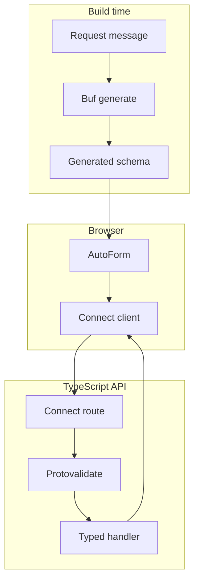

**第 6 级，共 8 级**

**前置条件：**[Oneof 表单](/docs/oneof-form)

这是学习路径中第一个需要服务器的示例。表单保持简洁，以便清晰呈现新概念：
类型化 ConnectRPC 错误会返回到对应字段。

## 新增内容

- 生成的 Connect Query mutation。
- 服务端 Protovalidate 强制校验。
- 将 `google.rpc.BadRequest.FieldViolation` 映射回单个输入框。
- 可见的等待、成功和错误状态。

同时启动示例 API 和文档应用：

```bash
bun run examples:generate
bun run examples:dev
```

<div className="my-8 border-y border-border/60 py-8">
  <ServerErrorFormExample />
</div>

实时表单会提交到 `http://127.0.0.1:55012`。使用以
`@blocked.example` 结尾的地址，可查看结构化服务器错误如何映射回 email 字段。

## 请求路径



浏览器会直接发送 resolver 的类型化 `SubmitBasicFormRequest`。无需手写
表单 DTO 或转换层。

## 契约

protobuf message 定义数据规则和可选的展示提示：

```proto
message SubmitBasicFormRequest {
  string display_name = 1 [
    (buf.validate.field).required = true,
    (buf.validate.field).string = { min_len: 2, max_len: 40 },
    (protoform.v1.field_ui).placeholder = "Ada Lovelace"
  ];

  string email = 2 [
    (buf.validate.field).required = true,
    (buf.validate.field).string.email = true,
    (protoform.v1.field_ui).control = CONTROL_TYPE_EMAIL
  ];
}
```

## Connect Query provider

```tsx
import { TransportProvider } from "@connectrpc/connect-query"
import { createConnectTransport } from "@connectrpc/connect-web"
import { QueryClient, QueryClientProvider } from "@tanstack/react-query"

const queryClient = new QueryClient()
const transport = createConnectTransport({
  baseUrl: "http://127.0.0.1:55012",
})

<TransportProvider transport={transport}>
  <QueryClientProvider client={queryClient}>
    <ServerErrorMutationForm />
  </QueryClientProvider>
</TransportProvider>
```

`TransportProvider` 提供类型化 Connect transport。`QueryClientProvider` 管理 mutation 状态、
重试和生命周期回调。

## 标准 mutation

使用 Connect Query 生成的一元方法描述符。无需手写请求函数或 query key：

```tsx
import { useMutation } from "@connectrpc/connect-query"

function ServerErrorMutationForm() {
  const mutation = useMutation(
    FormExamplesService.method.submitBasicForm
  )

  async function onSubmit(values, form) {
    try {
      const response = await mutation.mutateAsync(values)
      showCreatedProfile(response.profileId)
    } catch (error) {
      if (!applyServerFieldErrors(error, SubmitBasicFormRequestSchema, form)) {
        throw error
      }
    }
  }

  return (
    <div aria-busy={mutation.isPending}>
      <AutoForm
        schema={SubmitBasicFormRequestSchema}
        onSubmit={onSubmit}
        withSubmit
      />
    </div>
  )
}
```

`mutateAsync` 让表单提交 promise 保持等待状态，因此 AutoForm 会禁用提交按钮并显示
加载标签。`mutation.isPending` 也会将 mutation 状态暴露给周边 UI。请求成功后会渲染
返回的 profile 名称。结构化 Connect 错误会映射回字段；未知的 transport 或编程错误
会被重新抛出，而不会静默消失。

## 服务器

```ts
export const formExamplesService = {
  submitBasicForm(request) {
    return {
      displayName: request.displayName,
      profileId: `profiles/${slugify(request.displayName)}`,
    }
  },
} satisfies ServiceImpl<typeof FormExamplesService>

const routes = (router: ConnectRouter) => {
  router.service(FormExamplesService, formExamplesService)
}

const handler = connectNodeAdapter({
  interceptors: [createValidateInterceptor()],
  routes,
})

createServer(handler).listen(55012, "127.0.0.1")
```

interceptor 会在服务器上执行相同的 Protovalidate 注解。业务规则会返回包含
`google.rpc.BadRequest.FieldViolation` 详情的标准 `invalid_argument` 错误，而不是
需要浏览器解析的消息字符串。

## 底层客户端替代方案

在 React 之外，或应用代码有意不使用 TanStack Query 时，可通过 Connect client 调用
同一个生成的一元方法：

```ts
const client = createClient(
  FormExamplesService,
  createConnectTransport({ baseUrl: "http://127.0.0.1:55012" })
)

const response = await client.submitBasicForm(values)
```

请求和响应契约完全相同。当 React 应用需要等待、成功和错误生命周期状态时，应优先使用
mutation hook。

## Standard Schema 接口

Protoform 将 protobuf 校验契约公开为 Standard Schema v1。AutoForm 对类型化 message
和表单路径映射使用 protobuf 感知的 resolver；其他 Standard Schema consumer 也可以
使用同一个生成的描述符，而无需依赖 React Hook Form。

源代码位于 [`examples/basic`](https://github.com/malinskibeniamin/protoform/tree/main/examples/basic)
和 [`examples/server`](https://github.com/malinskibeniamin/protoform/tree/main/examples/server)。
