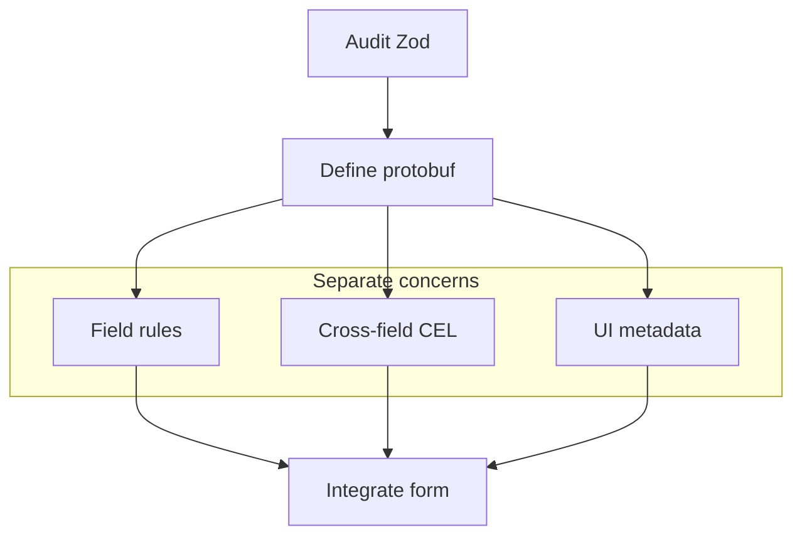

Protoform 提供迁移提示词生成器，因为让 LLM 执行重复的映射工作，再由人工审查契约，通常能更安全地完成 schema 迁移。

对于 Yup，请先完成
[从 Yup 迁移](/docs/yup-migration)中的转换、存在性、条件规则和异步测试审计，再让智能体转换 schema。

## 连接智能体

使用 `/llms.txt` 获取精简文档索引，或使用 `/llms-full.txt` 获取完整文档集。
针对性的演示页面也可通过在 URL 后添加 `.md` 来提供原始 Markdown，其中包含与 Preview 和 Code 标签页相同的
可复制源代码。

Protoform 默认使用 React Hook Form，同时明确提供互操作示例：

```ts twoslash
type FormEngine =
  | "react-hook-form"
  | "tanstack-form"
  | "formik"
  | "final-form";

const defaultEngine = "react-hook-form" satisfies FormEngine;
//    ^?
```

## 生成提示词

```bash
bun run migrate:zod -- src/components/settings-form.tsx proto/settings.proto
```

该脚本要求编码智能体：

1. 盘点每个 Zod 字段、message、正则表达式、enum、union、默认值和 refinement。
2. 将标量约束移至 `buf.validate.field`。
3. 将跨字段 refinement 移至 message 级 CEL 表达式。
4. 将可辨识 union 转换为 protobuf `oneof`。
5. 使用 `Field`、`FieldLabel`、`FieldDescription` 和 `FieldError` 保留 shadcn 的无障碍能力。
6. 将 `zodResolver` 替换为 `useProtoForm`。
7. 使用 `setServerErrors` 映射 Connect/gRPC 后端验证错误。
8. 为标签、帮助信息、占位符、可见性规则和数据提供程序提出 AutoForm UI 注解方案。

## 人工审查清单

- proto 字段名是否足够稳定，可以作为 API 契约名称？
- 是否有 Zod transform 隐藏了应改为显式转换代码的业务逻辑？
- CEL id 是否稳定且便于搜索？
- 错误消息能否在不依赖颜色的情况下支持屏幕阅读器？
- 可选字段是否采用了正确的 proto 存在性语义？
- 更新表单是否需要 Google AIP 字段掩码？

## 迁移结构


