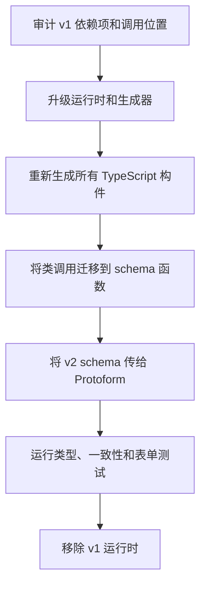

> **范围：** 本指南介绍 `@bufbuild/protobuf` 和 `@bufbuild/protoc-gen-es`
> **从 v1 到 v2 的包迁移**。这不是从 proto2 到 proto3 的迁移，也不同于
> 在 Buf 配置文件中将 `version: v1` 更改为 `version: v2`。

Protobuf-ES v2 是 Protoform 的标准运行时，也是唯一获得完整功能开发支持的运行时。对于分阶段升级，`protobuf-v1-bridge` 注册表项提供了
隔离的临时迁移桥接层。该桥接层接受 Protobuf-ES v1 生成的类，且不会
向现代 v2 provider 添加 v1 代码路径。

v2 API 采用 schema-first 模式：生成的代码导出 TypeScript 消息类型和运行时 `Schema`
值，而不是生成的消息类。

[官方 Protobuf-ES 迁移章节](https://github.com/bufbuild/protobuf-es/blob/main/MANUAL.md#migrating-from-version-1)
是运行时和生成器变更的权威来源。本指南补充了 Protoform 特有的
步骤和安全的发布顺序。

## 可选的 v1 桥接层

仅当表单必须先于其所属包使用 Protobuf-ES v2 重新生成时，才使用该桥接层。
它可以反射由 proto2 和 proto3 生成的 v1 消息类，渲染标量、
枚举、嵌套、重复、映射、oneof、bytes 和 64 位字段，保留 proto2 optional 存在性，
并在安全转换后返回类型化的 v1 消息。

将 v1 运行时和桥接层限制在旧版包边界内：

```bash
bun add @bufbuild/protobuf@^1.10.1
bunx shadcn@latest add @protoform/protobuf-v1-bridge
```

```tsx
import { createProtobufV1Provider } from "@/lib/protobuf-v1-bridge";
import { LegacyProfileRequest } from "./gen/legacy_profile_pb.js";

const legacyProfileProvider = createProtobufV1Provider(LegacyProfileRequest);

export function LegacyProfileForm() {
  return (
    <AutoForm
      schema={legacyProfileProvider}
      withSubmit
      onSubmit={async (request) => {
        await submitLegacyProfile(request);
      }}
    />
  );
}
```

此桥接层特意不提供 Protovalidate 或 CEL 的功能对等、v2 UI 注解、AIP
资源行为、自动更新掩码或 v2 Connect Query schema。Proto2 `required` 和
线格式转换检查只是桥接层的安全保护措施，不能替代验证系统。迁移期间应继续
在现有服务器上执行业务验证，并像往常一样将其结构化错误映射到
表单中。

退出条件必须明确：使用 v2 插件重新生成消息，将类替换为其
生成的 `Schema`，把表单迁移到现代 provider，移除桥接依赖，然后证明
该包的依赖树中不存在旧版运行时。不要在桥接层上开发新功能，也不要在同一个
provider 内根据条件切换 v1/v2 行为。

## 迁移流程



## 1. 升级前审计

从通过的构建开始，并提交或以其他方式保留当前生成的输出。清点
所有生成或使用 protobuf 消息的包：

```bash
bun pm ls | rg '@bufbuild|@connectrpc'

rg -n --glob '!**/*_pb.*' \
  'new [A-Z][A-Za-z0-9_]*\(|\b[A-Z][A-Za-z0-9_]*\.(fromBinary|fromJson|fromJsonString)\(|\.(toBinary|toJson|toJsonString|clone)\(' \
  src packages
```

将搜索结果视为审计线索，而非确定性证据：它可能找到无关的类，也可能漏掉隐藏在
应用包装器后的调用。还要检查自定义代码生成器、生成的 SDK 依赖项、测试
fixture、worker 入口点，以及在公共 API 中发布 protobuf 值的包。

更改代码前记录基线：

```bash
bun run typecheck
bun run test:conformance
bun run test:unit
bun run test:integration
```

## 2. 升级一组兼容的包

同时升级运行时和生成器。生成文件与执行它的运行时必须
使用兼容的主版本。

```bash
bun add @bufbuild/protobuf@^2
bun add -d @bufbuild/protoc-gen-es@^2
```

如果应用使用 Protoform 技术栈的其他部分，也应确保其 protobuf 使用方采用兼容的
当前主版本：

```bash
bun add @bufbuild/protovalidate@^1 @connectrpc/connect@^2
```

如果存在 `@connectrpc/connect-web` 和其他 Connect 包，请将它们升级到 v2。如果仓库拥有自定义 JavaScript 或 TypeScript 生成器，
请将 `@bufbuild/protoplugin` 升级到 v2。对于生成的 SDK 依赖项，应选择使用 v2 ES 插件生成的 SDK，而不是让
v1 SDK 与 v2 运行时并存。

迁移后，不要再通过直接依赖保留 `@bufbuild/protobuf` v1。
使用包管理器的依赖树查找残留副本，并升级拥有该副本的包。

## 3. 更新生成配置

推荐的本地插件配置如下：

```yaml
version: v2
plugins:
  - local: protoc-gen-es
    out: src/gen
    opt:
      - target=ts
      - import_extension=js
    include_imports: true
inputs:
  - directory: proto
```

仅当 TypeScript 和 ESM 配置需要显式 JavaScript 导入扩展名时，才使用 `import_extension=js`。
Protobuf-ES v2 默认不添加扩展名。`ts_nocheck` 选项默认也处于关闭状态；
应尽可能保留严格的生成代码检查，或仅将 `ts_nocheck=true` 作为临时
兼容措施。

`include_imports: true` 会使生成器输出导入的定义，例如 Protovalidate option
descriptor。当生成的依赖项未提供这些定义时，需要启用此选项。避免
在一起加载的多个包中生成同一份导入定义。

如果改用远程插件，请固定到 v2 版本：

```yaml
version: v2
plugins:
  - remote: buf.build/bufbuild/es:v2.13.0
    out: src/gen
    opt: target=ts
```

然后重新生成所有输出。在此仓库中，完整命令为：

```bash
bun run proto:generate
```

切勿手动修改生成的 `_pb.ts` 文件。即使陈旧的 v1 输出可以成功通过 TypeScript 构建，
也不能证明运行时与生成器匹配；还应检查生成文件的前导注释和
导入内容。

## 4. 用 schema 替换类

Protobuf-ES v2 会为一条消息生成两个不同的导出：

```ts
import type { User } from "./gen/user_pb.js";
import { UserSchema } from "./gen/user_pb.js";
```

`User` 是 TypeScript 类型。`UserSchema` 是传给构造、
序列化、反射、验证、Connect 和 Protoform API 的运行时 descriptor。

### 构造消息

```ts
// v1
import { User } from "./gen/user_pb.js";

const user = new User({ firstName: "Ada" });
```

```ts
// v2
import { create } from "@bufbuild/protobuf";
import { UserSchema } from "./gen/user_pb.js";

const user = create(UserSchema, { firstName: "Ada" });
```

嵌套消息的初始化值在 `create()` 内仍可使用普通对象字面量。返回的消息
已经是带有 `$typeName` 的普通对象；请将 `PlainMessage<User>` 替换为 `User`，并移除
`toPlainMessage` 调用。

### 将序列化迁移到独立函数

| 典型 v1 类调用 | Protobuf-ES v2 调用 |
| --- | --- |
| `User.fromBinary(bytes)` | `fromBinary(UserSchema, bytes)` |
| `user.toBinary()` | `toBinary(UserSchema, user)` |
| `User.fromJson(value)` | `fromJson(UserSchema, value)` |
| `user.toJson()` | `toJson(UserSchema, user)` |
| `User.fromJsonString(text)` | `fromJsonString(UserSchema, text)` |
| `user.toJsonString()` | `toJsonString(UserSchema, user)` |
| `user.clone()` | `clone(UserSchema, user)` |
| `User.equals(a, b)` | `equals(UserSchema, a, b)` |

例如：

```ts
import {
  clone,
  equals,
  fromBinary,
  fromJson,
  type JsonValue,
  toBinary,
  toJson,
} from "@bufbuild/protobuf";
import { type User, UserSchema } from "./gen/user_pb.js";

declare const bytes: Uint8Array;
declare const json: JsonValue;

const fromWire: User = fromBinary(UserSchema, bytes);
const fromApi: User = fromJson(UserSchema, json);
const encoded = toBinary(UserSchema, fromWire);
const protoJson = toJson(UserSchema, fromWire);
const copied = clone(UserSchema, fromWire);
const unchanged = equals(UserSchema, fromWire, copied);
```

消息不再实现 `toJSON`。将消息传给 `JSON.stringify` 前，先使用 `toJson(UserSchema, message)` 转换。
应明确区分 ProtoJSON 转换与普通 JavaScript 对象
序列化。

Well-known type 及其辅助函数现在从 `@bufbuild/protobuf/wkt` 导入。例如，应将
Timestamp 和 Any 的导入迁移到该子路径，并结合消息 schema 使用 `timestampFromDate()` 和
`anyPack()` 等 v2 辅助函数。

## 5. 迁移 Protoform 调用位置

现代 Protoform provider 接受生成的 v2 schema 值，而不是 v1 构造函数。上述
临时桥接层是迁移期间唯一的例外：

```tsx
import { useProtoForm } from "@/hooks/use-proto-form";
import {
  type SignupRequest,
  SignupRequestSchema,
} from "./gen/signup_pb.js";

const form = useProtoForm(SignupRequestSchema, {
  defaultValues: {
    email: "",
    displayName: "",
  },
});

const submit = form.handleSubmit(async (values) => {
  const request: SignupRequest = form.createMessage(values);
  await client.signup(request);
});
```

对 `createProtoFormSchema(SignupRequestSchema)`、生成的表单绑定和
AutoForm descriptor 应用相同规则。删除接受构造函数或检查 v1 类静态成员的兼容包装器。
descriptor 反射应在运行时读取 `SignupRequestSchema`，而不是 `SignupRequest`。

## Buf 配置从 v1 到 v2 的迁移是独立操作

Buf 为 `buf.yaml`、`buf.work.yaml`、`buf.gen.yaml` 和 `buf.lock` 提供了迁移命令：

```bash
buf config migrate --diff
buf config migrate
buf build
buf lint
```

第一条命令预览重写结果，第二条命令执行写入。请参阅
[官方 Buf 配置迁移指南](https://buf.build/docs/migration-guides/migrate-v2-config-files/)
和 [`buf config migrate` CLI 参考](https://buf.build/docs/reference/cli/buf/config/migrate/)。

此工具仅迁移 Buf 配置文件。它不会升级 npm 依赖项、重新生成
消息，也不会重写 Protobuf-ES TypeScript 调用位置。使用 `version: v2` 的 `buf.gen.yaml` 仍可运行
v1 插件，因此仅凭配置版本无法证明应用已使用 Protobuf-ES v2。

## Codemod 指南

Buf 发布的 Protobuf-ES 迁移指南没有提供官方的调用位置 codemod。官方
自动化工具是 `buf config migrate`，其作用域仅限于上述配置文件。

在缺少项目和类型信息时，将 `new User()` 批量重写为 `create(UserSchema)` 并不安全。
它必须区分 protobuf 类和普通类、创建无冲突的
导入、分离类型和值导入、找到使用别名的生成符号，并更新序列化
包装器。建议采用以下编译器驱动的顺序：

1. 同时升级运行时和生成器。
2. 重新生成所有自有 schema 和 SDK。
3. 运行第一节中的审计搜索。
4. 运行 TypeScript，并逐个包迁移错误。
5. 审查每个新增的 `Schema` 导入，不要直接接受盲目的文本重写。
6. 移除 v1 前，运行二进制和 ProtoJSON 往返 fixture。

如果仓库以后添加 codemod，应基于 TypeScript AST 实现，要求提供明确的生成
模块允许列表，支持 dry run，并拒绝有歧义的调用位置，而不是进行猜测。

## monorepo 的分阶段迁移

上游运行时支持在分阶段迁移期间并行运行 v1 和 v2。将每个运行时
限制在清晰的包边界内，并确保每个包在生成代码迁移到 v2 后尽快
退出桥接层：

1. 首先迁移拥有生成代码的叶子包。
2. 跨越临时 v1/v2 边界时，传递二进制字节或经过验证的 ProtoJSON，而不是运行时身份
   不明确的消息实例。
3. 迁移使用方，并立即删除边界适配器。
4. 持续检查依赖树，直到 v1 运行时消失。

不要将 v1 消息类传入 v2 reflection、Connect、Protovalidate 或 Protoform API。不要
发布有时返回 v1 消息、有时返回 v2 消息的库接口。

## 常见故障

### 无法解析 `@bufbuild/protobuf/codegenv1`

包含 `codegenv1` 的导入通常意味着 v2 生成的代码正在使用兼容
代码生成路径，而 bundler 无法解析包导出，或者运行时与生成的
构件不匹配。使用预期的 v2 插件重新生成，确认运行时主版本，并
确保 bundler 支持包导出。不要将内部兼容文件复制到
应用中。

### 无法解析生成的导入

如果生成的代码导入了 `buf/validate/validate_pb` 等本地定义，但该定义
不存在，请使用匹配的生成依赖项，或为所属生成目标启用 `include_imports: true`。
不要创建空的占位模块。

### ESM 导入扩展名失败

确认运行时需要无扩展名导入、`.js` 还是 `.ts`，然后统一设置生成器
选项。对于由 TypeScript 编译的 Node ESM 项目，即使源文件以 `.ts` 结尾，
`import_extension=js` 通常也是正确的输出。

### JSON 输出已更改

不要比较 v1 和 v2 的 `JSON.stringify(message)`。应比较
`toJson(MessageSchema, message)` 或 `toJsonString(MessageSchema, message)` 的结果，并测试 API 要求的确切
ProtoJSON 行为。

## 验证清单

- [ ] 运行时、生成器、Connect、Protovalidate 和生成的 SDK 版本相互兼容。
- [ ] 所有生成文件的前导注释均标明 v2 ES 插件。
- [ ] 不存在手动编辑的生成文件。
- [ ] 构造过程使用 `create(MessageSchema, init)`。
- [ ] 二进制和 JSON 操作传入匹配的 schema。
- [ ] Well-known type 辅助函数从 `@bufbuild/protobuf/wkt` 导入。
- [ ] Protoform、Standard Schema、AutoForm 和生成的绑定均接收 v2 schema。
- [ ] 二进制和 ProtoJSON 往返 fixture 均通过。
- [ ] 在使用相关功能的地方，嵌套消息、oneof、optional 存在性、映射、重复字段、64 位整数、Any 和
  Timestamp fixture 均通过。
- [ ] 结构化服务器错误仍能映射到所有预期的表单路径。
- [ ] `bun run proto:generate`、类型检查、一致性测试、单元测试、集成测试、浏览器测试和端到端
  测试均通过。
- [ ] 包依赖树中不存在应用代码直接使用的 v1 运行时。

Protoform 的[一致性测试套件](/docs/conformance)涵盖共享的表单契约，而
[生产就绪性配置文件](/docs/production-readiness)跟踪更广泛的 protobuf 功能覆盖情况。
