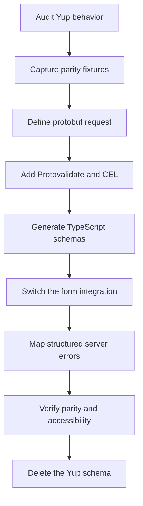

目标并不是逐一翻译每个 Yup 调用。Yup 在一个对象中结合了解析、默认值、
转换、验证和 TypeScript 类型推断。protobuf 优先的表单会将这些职责分开：

- protobuf 字段类型定义请求结构
- Protovalidate 注解定义可移植的验证
- CEL 定义确定性的跨字段规则
- 表单 `defaultValues` 定义初始 UI 状态
- 显式应用代码负责规范化及其他转换
- 服务器负责异步业务检查，并返回结构化字段违规信息

从行为而非语法入手。更改表单之前，记录 Yup schema 接受、拒绝、转换、移除哪些内容，以及应用哪些默认值。

## 迁移流程



## 迁移前后对比

一个典型的 Yup schema 可能同时混合所有这些关注点：

```tsx
import * as yup from "yup";

export const accountSchema = yup.object({
  displayName: yup.string().trim().min(2).max(40).required(),
  email: yup.string().email().required(),
  plan: yup.mixed<"starter" | "enterprise">()
    .oneOf(["starter", "enterprise"])
    .required(),
  seats: yup.number().integer().min(1).max(100).required(),
  website: yup.string().url().nullable().optional(),
  tags: yup.array()
    .of(yup.string().min(1).required())
    .min(1)
    .max(10)
    .required(),
}).noUnknown();
```

将请求结构和可移植规则迁移到 protobuf：

```proto
syntax = "proto3";

package account.v1;

import "buf/validate/validate.proto";

enum Plan {
  PLAN_UNSPECIFIED = 0;
  PLAN_STARTER = 1;
  PLAN_ENTERPRISE = 2;
}

message CreateAccountRequest {
  string display_name = 1 [
    (buf.validate.field).required = true,
    (buf.validate.field).string = { min_len: 2, max_len: 40 }
  ];

  string email = 2 [
    (buf.validate.field).required = true,
    (buf.validate.field).string.email = true
  ];

  Plan plan = 3 [(buf.validate.field).enum = {
    defined_only: true
    not_in: 0
  }];

  int32 seats = 4 [(buf.validate.field).int32 = {
    gte: 1
    lte: 100
  }];

  optional string website = 5 [(buf.validate.field).string.uri = true];

  repeated string tags = 6 [(buf.validate.field).repeated = {
    min_items: 1
    max_items: 10
    items: { string: { min_len: 1 } }
  }];
}
```

`int32` 类型替代 Yup 的 `integer()` 断言。枚举替代封闭的 `oneOf()` 集合。
provider 在验证后将表单结构的值转换为生成的 protobuf 消息。

## 规则映射

此表用于辅助清点，而不是作为自动重写规则：

| Yup | Protobuf 和 Protoform | 迁移前检查 |
| --- | --- | --- |
| `string().required()` | `required = true`，通常与 `min_len` 一起使用 | 空字符串和字段是否存在是不同的问题 |
| `string().min(n)` / `max(n)` | `string.min_len` / `string.max_len` | Protovalidate 按 Unicode 字符计数 |
| `string().length(n)` | `string.len` | 不要将 `len` 与最小值或最大值规则结合使用 |
| `string().matches(regex)` | `string.pattern` | Protovalidate 使用 RE2，而不是 JavaScript RegExp |
| `string().email()` | `string.email = true` | 重新运行现有的电子邮件接受和拒绝固件 |
| `string().url()` | `string.uri = true` | URI 和 URL 的接受范围可能不同 |
| `string().uuid()` | `string.uuid = true` | 单独保留任何特定版本策略 |
| `number().integer()` | 选择整数 protobuf 字段类型 | 选择 `int32`、`int64` 或无符号类型前，确认范围和符号要求 |
| `number().min(n)` / `max(n)` | 数值 `gte` / `lte` | Yup 默认转换字符串；protobuf 字段不会继承该行为 |
| `number().moreThan(n)` / `lessThan(n)` | 数值 `gt` / `lt` | 保留边界是包含还是排除的语义 |
| `mixed().oneOf(values)` | 使用 `defined_only` 和未指定值规则的枚举 | 当每个选项具有不同的对象结构时使用 `oneof` |
| `mixed().notOneOf(values)` | 标量 `not_in` 或 CEL | 确保列表稳定且归契约所有 |
| `array().min(n)` / `max(n)` | `repeated.min_items` / `max_items` | 添加 `items` 规则以验证元素 |
| `array().of(schema)` | 重复标量规则或嵌套消息 | 对象数组会成为重复消息 |
| `object().shape(...)` | 嵌套消息 | 确定缺失是否具有含义 |
| `object().required()` | 带有 `required = true` 的消息字段 | 消息存在性是显式的；标量存在性需要更谨慎地处理 |
| `date()` | `google.protobuf.Timestamp` | 将字符串或 Date 转换移至表单边界 |
| `boolean().oneOf([true])` | `bool.const = true` | 适用于必需的确认项 |

## 存在性、null 和空值

Yup 的 `required()`、`defined()`、`nullable()`、`optional()` 和 `notRequired()` 描述不同的
状态。不要将它们合并为一条 protobuf 规则。

### 必填字符串

Yup `string().required()` 会同时拒绝缺失值和空字符串。对于必填的 protobuf
字符串，应同时保留存在性意图和有意义的最小长度：

```proto
message CreateAccountRequest {
  string display_name = 1 [
    (buf.validate.field).required = true,
    (buf.validate.field).string.min_len = 1
  ];
}
```

如果 `trim().required()` 之前会拒绝仅含空白字符的字符串，请决定是将其规范化还是拒绝。
转换与验证规则并不是相同的行为。

### 可选字段

当请求必须区分字段缺失与标量零值时，请使用 `optional`：

```proto
message CreateAccountRequest {
  optional string website = 2 [(buf.validate.field).string.uri = true];
}
```

缺失的可选字段会跳过其特定类型规则。显式存在的空字符串仍然是一个值。
请测试这两种情况。

### 可为 null 的字段

`nullable()` 允许 JavaScript `null`。Protobuf 支持存在性，但不会为每个标量提供
领域层面的 null 值。请明确选择处理方式：

1. 当 `null` 与缺失含义相同时，在表单边界将 `null` 规范化为缺失。
2. 当缺失与存在有区别时，使用可选标量。
3. 当 null 是真实的领域状态时，使用 wrapper、嵌套消息、枚举或 `oneof`。

不要悄悄地将有意义的 `null` 转换为空字符串或零。

## 默认值和转换

Yup 可能会先转换再验证。因此，`default()`、`transform()`、`trim()`、`lowercase()`、`ensure()`、
`strip()`、`camelCase()`、`json()` 和 `noUnknown()` 需要做出行为决策，而不是添加
验证注解。

| Yup 行为 | 迁移目标 |
| --- | --- |
| 来自 `default()` 的 UI 初始值 | 所选表单库的初始值 API |
| 处理请求时应用的业务默认值 | 显式服务器默认值处理 |
| `trim()` 或大小写规范化 | 创建消息前的显式预处理，或使用 CEL 拒绝非规范输入 |
| `number()` 字符串转换 | 数值输入控件加显式的表单到 protobuf 转换 |
| `date()` 转换 | 显式转换为 `google.protobuf.Timestamp` |
| `strip()` / `stripUnknown()` | 仅构造已声明的 protobuf 字段；单独审查任何安全假设 |
| `noUnknown()` / `exact()` | 需要拒绝未知键时，在 JSON 或 HTTP 信任边界进行验证 |

Protobuf 标量默认值是线格式行为，不能替代 Yup UI 默认值。将可见默认值保留在表单中，
以便用户检查将要提交的内容。

如果规范化会更改存储或签名的数据，请勿将其放入隐藏的客户端转换中。应将其显式化、
独立测试，并在服务器上应用相同规则。

## 条件规则和跨字段规则

将确定性的 `when()` 条件和同级 `ref()` 比较迁移到消息级 CEL。
例如：

```tsx
const schema = yup.object({
  plan: yup.number().required(),
  seats: yup.number().when("plan", {
    is: 2,
    then: (current) => current.min(5),
    otherwise: (current) => current.min(1),
  }),
});
```

变为：

```proto
message CreateAccountRequest {
  option (buf.validate.message).cel = {
    id: "create_account.enterprise_seats"
    message: "Enterprise accounts require at least 5 seats."
    expression: "this.plan != 2 || this.seats >= 5"
  };

  Plan plan = 1;
  int32 seats = 2 [(buf.validate.field).int32.gte = 1];
}
```

为每条 CEL 规则提供稳定、可搜索的 id 和面向用户的消息。仅影响展示的条件应保留在 UI
元数据中，不要将其转化为 API 验证。

## 自定义和异步测试

迁移每个 Yup `test()` 前，先对其分类：

| 测试行为 | 目标位置 |
| --- | --- |
| 对单个值的纯检查 | 内置 Protovalidate 规则或字段 CEL |
| 请求字段之间的纯比较 | 消息 CEL |
| 查询、唯一性检查、授权、配额或其他 I/O | 服务器处理程序或服务层 |
| 仅 UI 警告 | 表单 UI 状态，而不是 protobuf 契约 |

Yup 自定义测试可以是异步的，并且其执行顺序不受保证。不要将依赖网络的测试复制到
客户端验证中。提交类型化请求，返回带有 `BadRequest.FieldViolation` 详情的规范 Connect
错误，并调用 `setServerErrors(error)`，确保每个违规信息都显示在其所属字段中。手动构建的表单集成应遵循
[TanStack Form 指南](/docs/tanstack-form)、
[Formik](/docs/formik) 或 [Final Form](/docs/final-form) 指南中的结构化映射。

如果在用户输入时保留可用性检查，请将其作为单独的防抖查询，并支持请求取消。
提交路径仍必须在服务器上强制执行该规则。

## 对象、数组和联合类型

- 嵌套 Yup 对象会成为嵌套 protobuf 消息。
- 数组会成为重复字段；将元素规则放在 `items` 或嵌套消息中。
- 以字符串为键的 record 通常会成为 protobuf map；分别验证键和值。
- 封闭的标量选项会成为带有 `UNSPECIFIED` 零值的枚举。
- 当恰好一个分支有效时，可辨识对象联合会成为 protobuf `oneof`。
- 仅用于确认的字段（例如 `passwordConfirmation`）不一定属于 API
  请求。如果服务器永远不需要该字段，请将其保留在本地。

切换 `oneof` 分支时，必须清除上一个分支的值，防止残留数据到达
服务器。请参阅 [Oneof 边界情况](/docs/oneof-edge-cases)。

## 切换表单集成

对于 React Hook Form，将 `yupResolver(schema)` 替换为支持 protobuf 的 hook：

```tsx
const form = useProtoForm(CreateAccountRequestSchema, {
  defaultValues: {
    displayName: "",
    email: "",
    plan: 0,
    seats: 1,
    website: undefined,
    tags: [],
  },
});

const submit = form.handleSubmit(async (values) => {
  try {
    await client.createAccount(form.createMessage(values));
  } catch (error) {
    if (!form.setServerErrors(error)) {
      throw error;
    }
  }
});
```

首次迁移期间保留现有的 shadcn 字段。同时更改 schema 契约和
可视化表单会使一致性问题更难诊断。契约稳定后，可以在后续变更中采用
AutoForm。

TanStack Form 可通过 Standard Schema 使用 `createProtoFormSchema`，无需 Yup adapter。
有关类型化输出和服务器错误处理，请参阅 [TanStack Form](/docs/tanstack-form)。
Formik 用户可将 `validationSchema` 替换为 `validate={createFormikValidator(schema)}`；Final
Form 应用使用 [Final Form](/docs/final-form) 中对应的 adapter。

## 错误一致性

Yup 通常使用 `abortEarly: true` 运行；许多表单 resolver 会覆盖此设置，使用户可以看到多个
错误。Protoform 会映射完整的 Protovalidate 问题列表。请显式保留该行为：

- 渲染字段的所有错误，而不仅是第一个错误
- 确保根级 CEL 失败保持可见
- 设置 `aria-invalid`，并将每个输入框关联到其错误说明
- 提交后聚焦第一个无效字段
- 客户端或服务器失败后保留所有已输入的值
- 切勿根据人类可读的错误消息文本进行分支判断

自定义 Yup 消息可能与 Protovalidate 生成的消息并非逐字匹配。仅当产品行为依赖精确文案时才保留；
否则应断言规则 id、字段路径和可读语义。

## 分阶段推出

1. **清点：** 记录每个 Yup 字段、默认值、转换、条件分支、自定义测试和
   resolver 选项。
2. **捕获：** 添加一致性固件，覆盖接受、拒绝、缺失、null、空值、边界和
   已转换输入。
3. **建模：** 定义 protobuf 类型、存在性、枚举、嵌套消息、重复字段、map 和
   `oneof` 分支。
4. **验证：** 先添加内置规则，再添加跨字段行为所需的最少 CEL。
5. **生成：** 运行代码生成，并在更改表单前检查生成的类型。
6. **集成：** 替换 Yup resolver，同时保留当前字段和 UX。
7. **比较：** 使用 Yup 和 `createProtoFormSchema` 运行相同的一致性固件；检查每个
   有意为之的差异。
8. **强制执行：** 在服务器上验证请求，并将结构化错误映射回表单。
9. **移除：** 当不再有使用方时，删除 Yup schema、`yupResolver`、兼容性转换和 Yup 依赖。

避免让两个 schema 同时成为权威来源。短暂的比较阶段很有用；永久双重
验证会重新造成此次迁移旨在消除的契约漂移。

## 验证清单

- `buf lint` 接受每个注解和 CEL 规则。
- `buf breaking` 未报告任何未经审查的线格式或 JSON 兼容性变更。
- 代码生成会产生预期的字段、枚举、嵌套消息和 `oneof` 类型。
- 新旧一致性固件对预期的有效和无效输入得出相同结果。
- 已检查 JavaScript 正则表达式是否存在与 RE2 不兼容的特性，例如前后查找和
  反向引用。
- 对缺失、空、null 和零值都有明确预期。
- Yup 转换和默认值在验证之外都有明确的归属位置。
- 客户端和服务器都执行 protobuf 验证契约。
- 所有字段、根级和结构化服务器错误均保持可见且可访问。
- 迁移完成后，最终 bundle 和依赖图不再包含 Yup。

Yup 官方文档区分转换与验证测试，并记录了
`when()`、`test()`、`nullable()`、默认值、类型转换和未知键处理的行为。审查原始 schema 时，请使用
[Yup 参考文档](https://github.com/jquense/yup)。Protovalidate 的
内置注解和 CEL 规则由 Buf 的
[PROTOVALIDATE lint 规则](https://buf.build/docs/lint/rules/#protovalidate)进行验证。
