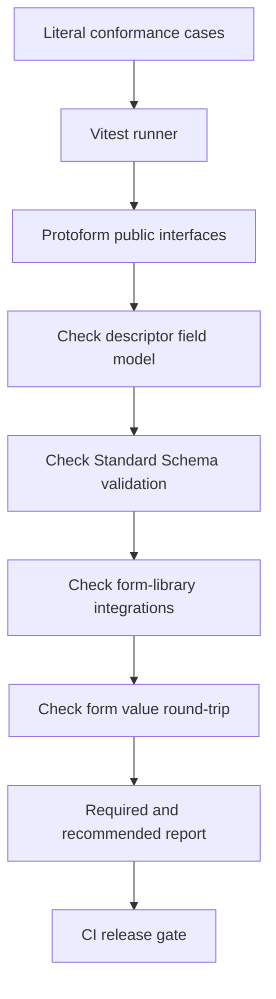

Protoform 为表单适配器所依赖的核心和 protobuf 行为提供独立的一致性测试套件，同时覆盖受支持的 TanStack Form、Formik 和 Final Form 集成。直接运行：

```bash
bun run test:conformance
```

其设计沿用了 [Protocol Buffers 一致性测试套件](https://github.com/protocolbuffers/protobuf/tree/main/conformance)中实用的职责分离方式：运行器负责测试用例和预期结果，实现则通过一个精简的公共接口接受测试。由于受支持的实现使用 TypeScript，Protoform 目前通过 Vitest 在进程内运行此模型。在没有其他语言适配器需要测试的情况下，引入子进程线协议只会增加成本。

[生产就绪度仪表板](/docs/production-readiness)将这些通过的用例纳入更大且带版本的统计基数。一致性用于判断已实现的契约是否通过；就绪度则明确区分已验证、已延期、不受支持以及由外部负责的能力。



## 契约级别

| 级别 | 契约 | 示例 |
| --- | --- | --- |
| **必需** | 每个受支持的 Protoform 版本都必须保留的行为 | Standard Schema v1 元数据、标量和复合字段种类、类型化输出、必填字段、oneof 和表单形态的路径 |
| **推荐** | 完整 protobuf provider 和受支持集成应提供的丰富行为 | CEL 根级错误、格式规则、所有 map 违规、表单库提交和服务器错误、wrapper 和 well-known type 往返行为 |

默认运行两个级别，且两者都会阻止 CI 通过。这些名称描述的是可移植性的最低标准，而不是允许列表：不存在预期失败、静默跳过或仅在本地通过的用例。

## 测试套件覆盖范围

### 从描述符到字段模型

测试套件解析一个包含字符串、64 位整数、枚举、消息、重复字段、map、oneof、时间戳、时长和基于 JSON 的 well-known type 的描述符。它断言 AutoForm 使用的稳定且与 schema 无关的字段模型，包括必填状态和控件提示。

### 从表单值到 protobuf

一个完整的有效 fixture 会传入 `createProtoFormSchema`。该用例断言 Standard Schema 返回类型化的 protobuf 消息，并保留字节、64 位整数、map 和处于活动状态的 oneof 分支。

标量矩阵还检查有符号和无符号 32 位及 64 位边界、float 和 double 特殊值，以及显式与隐式存在性。无效的整数输入会在其所属表单路径处被拒绝，避免其成为超出范围的 protobuf 值。

### 验证路径

无效 fixture 覆盖必填标量、嵌套消息、重复项、嵌套 map 值、缺失和无效的 oneof、格式约束、CEL 规则，以及单个 map 条目中的多项违规。预期路径是如下字面量形式的表单路径：

```text
shippingAddress.city
luckyNumbers.0
officeLocations.0.value.city
preferredContact.value
```

转换失败和消息级 CEL 失败必须返回可见的根级问题，而不能抛出异常或消失。

### 从 protobuf 到表单的往返转换

往返用例验证表单值、接收 protobuf 消息，并使用 `protoToFormValues` 将其转换回来。它验证可选字段、wrapper、JSON 值、map、字节、字段掩码、时长、64 位值和 oneof 的表单安全表示。

专用矩阵用例将该契约扩展到每种合法的 map 键类型、重复标量和枚举系列、每种标量 wrapper，以及 `Any` 载荷的打包与解包。格式错误的 base64 和渲染后重复的 map 键仍会作为字段错误显示。

### Protovalidate 规则矩阵

表驱动用例覆盖布尔常量；字符串值、Unicode 长度和字节长度、模式、前后缀、包含关系和成员关系；UUID 和去除空白后的 UUID 形式；枚举常量、别名、已定义值以及允许和拒绝列表；重复字段和 map 的基数；唯一性；以及 `Any` 类型 URL 列表。

其他表格覆盖 float/double 和每种整数系列；网络和标识符字符串；字节；Duration、FieldMask 和 Timestamp；忽略语义；自定义预定义规则；以及作为表单指引展示的非验证性标准示例。字段和消息 CEL 用例会保留规则 ID、动态消息、嵌套/重复路径和每项违规，并为无效表达式提供安全的根级问题。

电子邮件契约通过公共 Standard Schema 接口和受支持的表单适配器进行测试，因此适配器连接不会静默削弱描述符验证。

### Resource API 和运行时矩阵

Resource 用例验证 AIP resource 元数据、名称/ID/显示名称分离、标准字段、每种字段行为、标准 Create/Get/List/Update/Delete 结构、singleton 结构、最小更新掩码、所有规范的非 OK 状态码、结构化错误详情，以及未知详情类型的保留。

运行时用例还涵盖递归描述符边界、格式错误和恶意输入处理、50/200/500 字段的渲染模型和转换预算、bundle 预算、包兼容性配置、纯键盘步骤恢复、无障碍扫描、浏览器覆盖和 hydration 检查。

### TanStack Form 集成

测试套件还运行实际的 TanStack Form 示例。它验证 Protoform 的 Standard Schema 问题是否附加到所属字段、有效值在提交前是否转换为类型化 protobuf 消息，以及结构化服务器违规是否返回到正确的 TanStack 字段。

registry 集成测试套件分别检查原生 TanStack hook 和生成的 AutoForm。它覆盖原生 API 保留、标量和重复字段、oneof 分支清除、每个可见的 provider 问题、验证生命周期行为，以及根据 TanStack 字段元数据派生的更新掩码。

### Formik 和 Final Form 集成

测试套件针对生成的请求描述符和本地 TypeScript API 运行实际的 Formik 和 Final Form 示例。它验证客户端问题、类型化 protobuf 提交、结构化服务器错误以及无障碍字段状态。纯适配器用例还验证嵌套路径、重复索引、多项问题和原型污染防护。

## 运行和隔离用例

运行完整测试套件：

```bash
bun run test:conformance
```

开发单个契约时，使用 Vitest 的名称过滤器：

```bash
bun run test:conformance -- -t "nested map value"
```

主 `quality:gate` 命令和 CI 会运行完整测试套件。若更改描述符解析、验证规范化、Standard Schema 输出、protobuf 转换或 oneof 处理，应在发布前在此添加或更新字面量用例。

## 添加覆盖范围

1. 当现有矩阵未覆盖某项功能时，将最小的描述符功能添加到
   `conformance/proto/protoform/conformance/v1/conformance.proto`。
2. 使用 `bun run proto:generate` 重新生成已签入的绑定。
3. 在 `conformance/` 下匹配的文件中添加一个字面量输入和预期结果。
4. 在更改实现代码前，确认该用例会因预期缺失的行为而失败。
5. 运行聚焦用例，然后运行 `bun run test:conformance` 和 `bun run quality:gate`。

确保预期值独立于实现。不要使用被测的同一 helper 计算预期路径或字段种类；fixture 才是事实来源。
