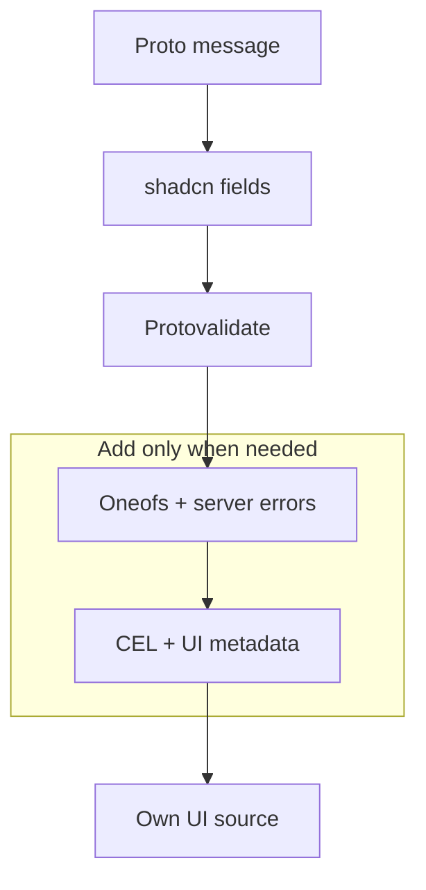

## 1. 添加注册表

在 `components.json` 中，将命名空间指向不可变的稳定版注册表快照：

```json
{
  "registries": {
    "@protoform": "https://raw.githubusercontent.com/malinskibeniamin/protoform/v1.0.0/public/r/{name}.json"
  }
}
```

固定 Git 标签，避免后续上游变更影响现有安装。保留
`/r/{name}.json` 路径，以便 shadcn 解析每个 `@protoform` 项。

然后安装：

```bash
bunx shadcn@latest add @protoform/protoform
```

注册表会将 hook、protobuf provider、共享字段模型和 UI 组件复制到你的
应用中。你可以随应用一起检查、调整样式并对所有这些源代码进行版本管理。

## 2. 配置公共 Buf 注册表

Buf 通过其公共 npm 注册表发布生成的 Google API 模块。将其作用域添加到使用方的
`.npmrc`：

```ini title=".npmrc"
@buf:registry=https://buf.build/gen/npm/v1/
```

无需令牌。注册表项声明了此模块及所有其他公共第三方
依赖，因此 `shadcn add` 会将它们与复制的源代码一起安装。没有 Protoform 自有的 npm
包。

## 3. 创建 protobuf 消息

```proto
syntax = "proto3";

package example.v1;

import "buf/validate/validate.proto";

message SignupRequest {
  string email = 1 [(buf.validate.field).string.email = true];
  string display_name = 2 [(buf.validate.field).string = {
    min_len: 2
    max_len: 40
  }];
}
```

使用 Buf 生成 TypeScript，然后将生成的 schema 传给 `useProtoForm`。

当使用方仓库需要重新生成表单绑定时，安装源代码生成器：

```bash
bunx shadcn@latest add @protoform/protoc-gen-protoform
```

```yaml
# buf.gen.yaml
version: v2
plugins:
  - local: ["bun", "run", "scripts/protoc-gen-protoform/run.ts"]
    out: src/gen
    opt: target=ts,import_extension=js
```

Protoform 仅支持 Protobuf-ES v2 schema。如果应用仍在生成 v1 消息
类，请先按照[迁移到 Protobuf-ES v2](/docs/protobuf-v2-migration)操作，再集成表单
运行时。

## 4. 从简单开始，按需增强



如需完整的五个 RPC 演练，请安装 bookstore 项：

```bash
bunx shadcn@latest add @protoform/bookstore
```

其中包含生成的绑定、创建和编辑 React Hook Form 流程、AutoForm 删除功能，以及
有界的内存示例服务。
