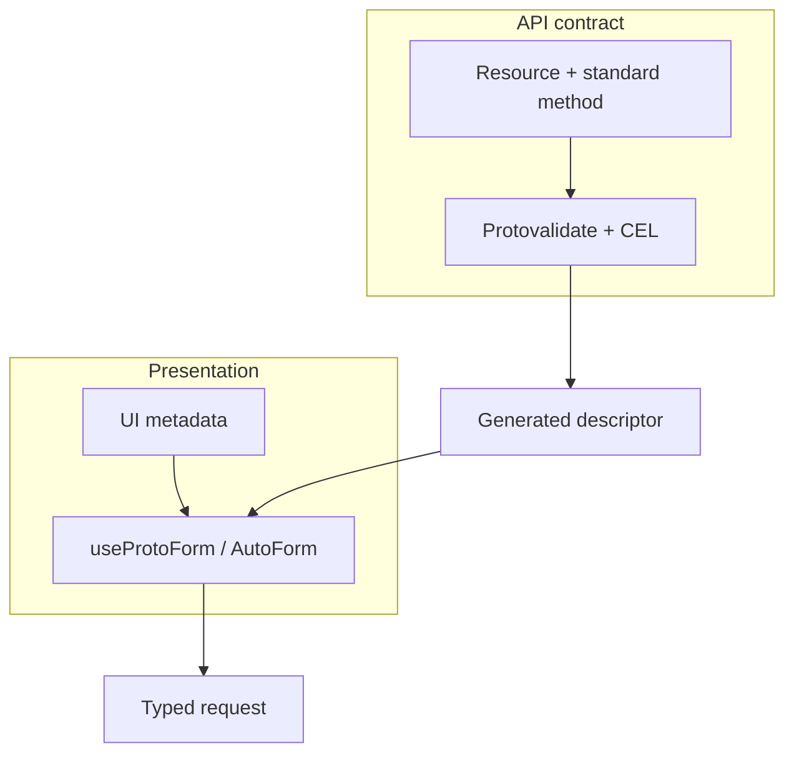

Protoform 最适合与面向资源的 protobuf API 配合使用。它会保留资源、验证和展示层，而不是用仅供前端使用的 DTO 取代它们。

Protoform 不会让任意 API 自动符合 AIP。API 所有者仍需定义并强制执行资源名称、标准方法、分页、更新掩码、并发和长时间运行操作的语义。随后，Protoform 会将该契约投射为类型化表单。

[生产就绪度仪表板](/docs/production-readiness)会分别衡量与表单相关的 AIP 支持和仅限后端的语义。每个适用的客户端工作流都有可执行证据，而后端和治理职责仍作为外部排除项清晰可见。

## 完整跟踪 General AIP 目录

官方 [General AIP 目录](https://google.aip.dev/general)是完整 General AIP 目录的基准。目录中的每个条目在就绪度台账中都有自己稳定的行。每行使用明确的就绪状态：

- Protoform 负责的行为使用**可执行一致性验证**，例如描述符投射、字段行为、更新掩码、类型化请求、结构化错误和脱敏。
- 当 protobuf 声明可以证明规则中表单可见的部分时，使用**静态模式检查**，例如资源关联、请求 ID、`validate_only`、资源修订版本、软删除、状态、过期和批量方法。
- 对于目前缺少证据的适用客户端行为，标记为**已推迟**或**不支持**。这些行会降低就绪度，并注明下一个可执行测试。
- 对于 Protoform 无法实现的后端强制执行、治理或仓库所有权，标记为**外部**。这些行仍保持可见，但不计入分母。

**仅有文档不算作**就绪度证据。指南可以解释 AIP，但只有可执行测试或静态模式断言才能将适用行标记为已验证。AIP-192 已得到验证，因为生成器测试证明公共消息和字段注释会注册为表单帮助信息。

| 目录系列 | 跟踪的条目 | 当前归属 |
| --- | --- | --- |
| 元信息和流程 | [AIP-1](https://google.aip.dev/1), [AIP-2](https://google.aip.dev/2), [AIP-3](https://google.aip.dev/3), [AIP-8](https://google.aip.dev/8), [AIP-9](https://google.aip.dev/9), [AIP-100](https://google.aip.dev/100), [AIP-200](https://google.aip.dev/200), [AIP-205](https://google.aip.dev/205) | 外部提案和 API 评审治理 |
| API 概念 | [AIP-111](https://google.aip.dev/111) | 外部后端平面边界 |
| 资源设计 | [AIP-121](https://google.aip.dev/121), [AIP-122](https://google.aip.dev/122), [AIP-123](https://google.aip.dev/123), [AIP-124](https://google.aip.dev/124), [AIP-126](https://google.aip.dev/126), [AIP-128](https://google.aip.dev/128), [AIP-129](https://google.aip.dev/129), [AIP-156](https://google.aip.dev/156) | 对资源、关联、枚举、声明式控制、服务器默认值和单例执行可执行或静态检查 |
| 操作 | [AIP-130](https://google.aip.dev/130), [AIP-131](https://google.aip.dev/131), [AIP-132](https://google.aip.dev/132), [AIP-133](https://google.aip.dev/133), [AIP-134](https://google.aip.dev/134), [AIP-135](https://google.aip.dev/135), [AIP-136](https://google.aip.dev/136), [AIP-151](https://google.aip.dev/151), [AIP-231](https://google.aip.dev/231), [AIP-233](https://google.aip.dev/233), [AIP-234](https://google.aip.dev/234), [AIP-235](https://google.aip.dev/235) | 已对标准、批量、自定义、流式和长时间运行方法进行分类；已验证操作进度、轮询、取消和终止错误 |
| 字段 | [AIP-140](https://google.aip.dev/140), [AIP-141](https://google.aip.dev/141), [AIP-142](https://google.aip.dev/142), [AIP-143](https://google.aip.dev/143), [AIP-144](https://google.aip.dev/144), [AIP-145](https://google.aip.dev/145), [AIP-146](https://google.aip.dev/146), [AIP-147](https://google.aip.dev/147), [AIP-148](https://google.aip.dev/148), [AIP-149](https://google.aip.dev/149), [AIP-202](https://google.aip.dev/202), [AIP-203](https://google.aip.dev/203), [AIP-216](https://google.aip.dev/216) | 已验证数量单位、标准化字符串代码、左闭右开范围、敏感字段和核心字段行为 |
| 设计模式 | [AIP-152](https://google.aip.dev/152), [AIP-153](https://google.aip.dev/153), [AIP-154](https://google.aip.dev/154), [AIP-155](https://google.aip.dev/155), [AIP-157](https://google.aip.dev/157), [AIP-158](https://google.aip.dev/158), [AIP-159](https://google.aip.dev/159), [AIP-160](https://google.aip.dev/160), [AIP-161](https://google.aip.dev/161), [AIP-162](https://google.aip.dev/162), [AIP-163](https://google.aip.dev/163), [AIP-164](https://google.aip.dev/164), [AIP-165](https://google.aip.dev/165), [AIP-210](https://google.aip.dev/210), [AIP-211](https://google.aip.dev/211), [AIP-214](https://google.aip.dev/214), [AIP-217](https://google.aip.dev/217), [AIP-236](https://google.aip.dev/236) | 已验证作业、导入/导出、跨集合、按条件删除、部分响应、不可达资源、策略预览及其余由客户端负责的模式；授权强制执行属于外部职责 |
| 兼容性和版本控制 | [AIP-180](https://google.aip.dev/180), [AIP-181](https://google.aip.dev/181), [AIP-182](https://google.aip.dev/182), [AIP-185](https://google.aip.dev/185) | 已验证兼容性、依赖项、包版本、预览和弃用展示 |
| 完善度 | [AIP-190](https://google.aip.dev/190), [AIP-191](https://google.aip.dev/191), [AIP-192](https://google.aip.dev/192), [AIP-193](https://google.aip.dev/193), [AIP-194](https://google.aip.dev/194) | 已验证命名、布局、生成的源码帮助、规范错误和感知幂等性的重试恢复 |
| Protocol buffers | [AIP-127](https://google.aip.dev/127), [AIP-213](https://google.aip.dev/213), [AIP-215](https://google.aip.dev/215) | 已验证知名组件以及 HTTP 路径、查询和正文角色；特定于 API 的 proto 所有权属于外部职责 |

从其可选子路径导入描述符和客户端工作流辅助函数。这样可以避免只使用核心表单提供程序的应用引入长时间运行操作元数据。

```ts
import {
  getProtoPartialResult,
  getProtoRetryDecision,
  runProtoOperation,
} from "@/lib/protobuf-provider/aip-client-workflow";
import { getProtoMethodWorkflow } from "@/lib/protobuf-provider/method-workflow";
```

验证范围经过有意限制。AIP-154 表示 Protoform 会保留 `etag`，并不表示它会强制执行并发控制。AIP-158 表示分页字段保持类型化且令牌保持不透明，并不表示客户端会证明服务器游标的稳定性。AIP-160 表示请求携带 `filter` 和 `order_by`，并不表示 UI 代码会授权或求值过滤器。AIP-194 表示 Protoform 只重试明确具有幂等性且返回 `UNAVAILABLE` 的一元调用；服务所有者仍需配置底层重试策略。



## 规范资源结构

资源应遵循 [AIP-121](https://google.aip.dev/121)、[AIP-122](https://google.aip.dev/122) 和 [AIP-123](https://google.aip.dev/123)：

```proto
import "buf/validate/validate.proto";
import "google/api/field_behavior.proto";
import "google/api/resource.proto";

message Connector {
  option (google.api.resource) = {
    type: "example.googleapis.com/Connector"
    pattern: "projects/{project}/locations/{location}/connectors/{connector}"
    singular: "connector"
    plural: "connectors"
  };

  string name = 1 [(google.api.field_behavior) = IDENTIFIER];
  string display_name = 2 [
    (google.api.field_behavior) = REQUIRED,
    (buf.validate.field).string.min_len = 1
  ];
  ConnectorState state = 3 [(google.api.field_behavior) = OUTPUT_ONLY];
  string etag = 4 [(google.api.field_behavior) = OUTPUT_ONLY];
}

enum ConnectorState {
  CONNECTOR_STATE_UNSPECIFIED = 0;
  CONNECTOR_STATE_ACTIVE = 1;
  CONNECTOR_STATE_FAILED = 2;
}
```

此结构是有意设计的：

- `name` 是字段 1，包含完整的相对资源名称，并且只有 `IDENTIFIER`。
- 显示文本有自己的 `display_name` 字段；纯 ID 绝不会伪装成 `name`。
- `(google.api.resource)` 声明 `type`、`pattern`、`singular` 和 `plural`。
- `field_behavior` 记录客户端职责；`buf.validate` 和 CEL 强制验证值。
- 枚举零值以 `_UNSPECIFIED` 结尾。
- 服务器所有的 `state` 和 `etag` 字段在编辑表单中为只读。

## 标准方法请求

使用标准请求结构，而不是自定义操作封装：

```proto
import "google/protobuf/field_mask.proto";

message GetConnectorRequest {
  string name = 1 [
    (google.api.field_behavior) = REQUIRED,
    (google.api.resource_reference).type = "example.googleapis.com/Connector"
  ];
}

message ListConnectorsRequest {
  string parent = 1 [
    (google.api.field_behavior) = REQUIRED,
    (google.api.resource_reference).child_type = "example.googleapis.com/Connector"
  ];
  int32 page_size = 2;
  string page_token = 3;
  string filter = 4;
  string order_by = 5;
}

message ListConnectorsResponse {
  repeated Connector connectors = 1;
  string next_page_token = 2;
}

message CreateConnectorRequest {
  string parent = 1 [
    (google.api.field_behavior) = REQUIRED,
    (google.api.resource_reference).child_type = "example.googleapis.com/Connector"
  ];
  Connector connector = 2 [(google.api.field_behavior) = REQUIRED];
  string connector_id = 3 [
    (google.api.field_behavior) = REQUIRED,
    (buf.validate.field).string.pattern = "^[a-z][a-z0-9-]{2,62}$"
  ];
}

message UpdateConnectorRequest {
  Connector connector = 1 [(google.api.field_behavior) = REQUIRED];
  google.protobuf.FieldMask update_mask = 2
    [(google.api.field_behavior) = REQUIRED];
}

message DeleteConnectorRequest {
  string name = 1 [
    (google.api.field_behavior) = REQUIRED,
    (google.api.resource_reference).type = "example.googleapis.com/Connector"
  ];
  string etag = 2;
}
```

| 方法 | AIP 契约 | 表单职责 |
| --- | --- | --- |
| Get / Delete | 发送完整的资源 `name`；Delete 可以发送 `etag` | 将标识信息与可编辑的显示字段分离 |
| List | 发送 `parent`、`page_size`、不透明的 `page_token`、字符串 `filter` 和 `order_by` | 将令牌视为不透明值，并在分页时保持过滤器稳定 |
| Create | 发送 `parent`、`connector` 和 `connector_id`；忽略 `connector.name` | 在资源正文之外验证 ID 格式 |
| Update | 发送资源及必需的 `update_mask` | 根据可编辑的更改构建掩码，绝不包含服务器所有的字段 |

## 自动生成最小更新掩码

AutoForm 会在每次提交时，根据原生 React Hook Form 或 TanStack Form 的脏状态计算符合 AIP 的掩码。第三个提交参数通过 `context.updateMask` 将其公开：

```tsx
<AutoForm
  defaultValues={profile}
  schema={MaskableProfileSchema}
  withSubmit
  onSubmit={async (nextProfile, _form, context) => {
    if (!context.updateMask?.paths.length) return;

    await updateProfile(create(UpdateMaskableProfileRequestSchema, {
      profile: nextProfile,
      updateMask: context.updateMask,
    }));
  }}
/>
```

较低层级的 hook 通过 `createUpdateMask()` 提供相同行为：

```tsx
const form = useProtoForm(MaskableProfileSchema, { defaultValues: profile });

const onSubmit = form.handleSubmit(async (values) => {
  const updateMask = form.createUpdateMask();
  if (!updateMask.paths.length) return;

  await updateProfile(create(UpdateMaskableProfileRequestSchema, {
    profile: form.createMessage(values),
    updateMask,
  }));
});
```

生成的掩码使用 protobuf snake-case 路径和描述符顺序。嵌套的单值消息会保留范围最小的脏叶节点。映射和重复字段会收拢到所属字段，因为 protobuf 字段掩码无法定位集合索引。oneof 组名绝不会进入掩码；Protoform 使用选中的分支，或在用户将其清除时使用初始分支。即使应用代码将 `IDENTIFIER`、`IMMUTABLE` 和 `OUTPUT_ONLY` 字段标记为脏，也会将它们省略。调用 `reset()` 会建立新的脏状态基线。

读取掩码需要显式指定，因为已触碰字段无法表明屏幕希望获取哪个投影。使用 `createFieldMask()` 验证、规范化、去重并最小化所请求的路径：

```ts
const readMask = createFieldMask(MaskableProfileSchema, [
  "displayName",
  "biography",
]);
// readMask.paths: ["display_name", "biography"]
```

客户端生成的更新掩码绝不会包含 `name`、不可变字段、仅输出字段、未知字段、通配符或裸 oneof 路径。服务器仍需验证每个掩码，仅应用其覆盖的字段，并验证合并后的资源，而不是仅验证补丁。`etag` 不匹配时应返回 `ABORTED`。列表令牌应编码稳定游标，并拒绝过滤器或排序不匹配的请求。当方法无法立即返回处于稳定状态的资源时，应使用 `google.longrunning.Operation`。

有关完整的标准方法规则，请参阅 [AIP-132](https://google.aip.dev/132)、[AIP-133](https://google.aip.dev/133)、[AIP-134](https://google.aip.dev/134)、[AIP-135](https://google.aip.dev/135)、[AIP-158](https://google.aip.dev/158)、[AIP-160](https://google.aip.dev/160) 和 [AIP-161](https://google.aip.dev/161)。

## 工作流示例与标准方法

仓库中的 `SubmitBasicForm` 和 `SubmitComplexForm` RPC 特意展示最小的端到端表单传输。它们是工作流示例，而不是面向资源的标准方法。不要将其自定义 `Submit*` 结构复制到创建或更新资源的 API 中。

对于创建表单，应在标准 Create 请求中保留 `parent`、`{resource}_id` 和资源消息。对于更新表单，应保留资源、`update_mask` 和 `etag` 语义。分步表单只是一种展示方式：它可以对这些请求字段进行分组，而不改变其 AIP 含义，也不需要虚构仅供前端使用的 DTO。

[服务器错误](/docs/server-error-form)和[复杂示例](/docs/complex-example)展示了传输、验证和错误恢复。上述标准请求结构仍是生产 API 指南。

## Protoform 如何遵循这些原则

| 原则 | Protoform 行为 |
| --- | --- |
| Protobuf 始终是 API 契约 | 生成的描述符驱动类型、验证路径、oneof 分支和表单输出 |
| 验证可强制执行，而非装饰性信息 | Protovalidate 和 CEL 执行契约规则；UI 注解仅控制展示 |
| 资源标识保持独立 | `name`、`{resource}_id` 和 `parent` 保留其 AIP 含义，而不会变成标签 |
| 服务器所有的字段仍归服务器所有 | `IDENTIFIER`、`OUTPUT_ONLY` 和 `IMMUTABLE` 元数据可以隐藏或渲染为只读 |
| 更新是显式的 | 更新表单可以根据脏的可编辑字段派生字段掩码；API 仍会对其进行验证 |
| 错误保留字段路径 | Connect/gRPC 字段违规会将 protobuf 路径映射回原生 React Hook Form 或 TanStack Form 字段 |
| 互操作具有可移植性 | protobuf 提供程序通过 Standard Schema v1 公开验证能力 |

这些是可执行行为，而不只是文档建议。AIP 一致性 fixture 会验证资源的 `type`、`pattern`、`singular` 和 `plural`；区分 `name`、`display_name` 和 `{resource}_id`；并在 Create 和 Update 请求上下文中以不同方式投射 `REQUIRED`、`OPTIONAL`、`IDENTIFIER`、`OUTPUT_ONLY`、`IMMUTABLE` 和 `INPUT_ONLY`。标准 Create/Get/List/Update/Delete 和单例请求结构均单独覆盖。

客户端错误生命周期遵循 [AIP-193](https://google.aip.dev/193)：规范状态码和结构化 `google.rpc.*` 详细信息用于驱动字段反馈、恢复和支持上下文。有关完整映射和重试指南，请参阅[服务器错误](/docs/server-errors)。

## AutoForm 展示元数据

将展示相关内容与资源契约分离：

```proto
import "protoform/ui/auto_form.proto";

message NotificationConfig {
  oneof delivery {
    WebhookDelivery webhook = 1 [(protoform.ui.oneof).label = "Webhook"];
    QueueDelivery queue = 2 [(protoform.ui.oneof).label = "Queue"];
  }
}
```

AutoForm 绑定可以携带标签、说明、文档链接、示例、分区和自定义控件，而不改变资源标识或标准方法语义。
