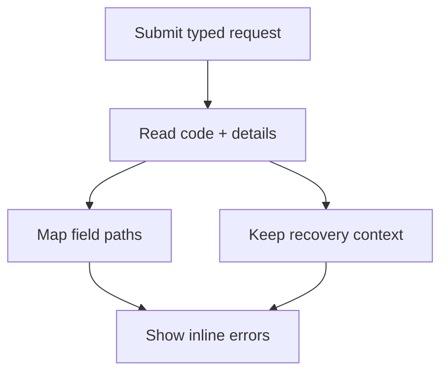

客户端验证可以改善反馈，但服务器仍是授权、并发、唯一性、配额和当前状态检查的权威来源。Protoform 将结构化 Connect 和 gRPC 错误映射到 3 个位置：字段错误、错误摘要和诊断上下文。

此方式遵循 [AIP-193](https://google.aip.dev/193)：使用规范状态码和标准 `google.rpc.*` 详细信息，而不是解析消息字符串。Connect 通过 [`ConnectError.findDetails()`](https://connectrpc.com/docs/web/errors/#error-details) 提供这些详细信息。



## 提交生命周期

发起新请求前调用 `clearServerErrorContext()`，然后将捕获的每个值传给 `setServerErrors()`。将返回的 `unmapped` 违规项保存在组件状态中，以免路径无法关联到字段时丢失后端错误。

```tsx
import type { FieldViolation } from "@/lib/protobuf-provider";
import { Button } from "@/components/ui/button";
import { useState } from "react";
import { toast } from "sonner";

const [unmapped, setUnmapped] = useState<FieldViolation[]>([]);

const onSubmit = form.handleSubmit(async (values) => {
  form.clearServerErrorContext();
  setUnmapped([]);

  try {
    await saveConnector(form.createMessage(values));
  } catch (error) {
    const result = form.setServerErrors(error);
    setUnmapped(result.unmapped);

    if (!result.handled && !result.context.message) {
      toast.error("Connector not saved. Check your connection and try again.");
    }
  }
});

return (
  <form onSubmit={onSubmit}>
    <ServerErrorSummary
      context={form.serverErrorContext}
      unmapped={unmapped}
    />
    {/* Registered fields */}
    <Button disabled={form.formState.isSubmitting} type="submit">
      Save connector
    </Button>
  </form>
);
```

`setServerErrors()` 返回：

| 值 | 含义 |
| --- | --- |
| `handled` | 至少有 1 个 `BadRequest.FieldViolation` 映射到表单字段时为 `true` |
| `unmapped` | 路径无法映射的所有字段违规项；应全部渲染 |
| `context` | 从同一错误中提取的状态和结构化非字段详细信息 |

同一个 `context` 会成为 `form.serverErrorContext`。非 Connect 错误会产生 `handled: false`、空的 `unmapped` 数组和空上下文。请为这种情况保留可见的通用回退提示。请求失败后不要重置表单，因为用户需要使用已提交的值来修正问题。

## 字段路径映射

当 hook schema 表示嵌套请求字段，而后端报告的路径从 RPC 请求根开始时，请设置 `serverPathPrefix`：

```tsx
const form = useProtoForm(NotificationSchema, {
  serverPathPrefix: "notification",
});
```

当等价的服务端契约可能将同一消息包装在不同的请求字段下时，请使用 `serverPathPrefixes`：

```tsx
const form = useProtoForm(CreateInstanceSpecSchema, {
  serverPathPrefixes: ["spec", "instance"],
});
```

此时，`spec.config.host` 和 `instance.config.host` 都会映射到 `config.host`。单数和复数选项会合并：先检查 `serverPathPrefix`，再按数组顺序检查 `serverPathPrefixes`。

| 后端字段路径 | 表单路径 |
| --- | --- |
| `notification.display_name` | `displayName` |
| `notification.shipping_address.postal_code` | `shippingAddress.postalCode` |
| `notification.delivery.webhook.signing_secret_ref` | `delivery.value.signingSecretRef` |
| `notification.delivery` | `delivery` |

Protoform 会移除第一个完全匹配的前缀，遍历 protobuf 描述符，将 protobuf `snake_case` 名称转换为 TypeScript `camelCase`，并将 oneof 分支扁平化到 `{oneofLocalName}.value` 下。它会聚焦第一个已映射字段，并使用 React Hook Form 错误类型 `server` 添加每个已映射违规项。通用 Protovalidate 描述使用与客户端验证相同的可操作文案，空描述则回退为 `Review this value and try again.`

未知字段会保留在 `unmapped` 中。`contacts[0].email` 等使用方括号索引的重复字段和 map 路径目前也无法映射，因为映射器解析的是描述符字段段，而不是集合索引。请在摘要中显示这些违规项，不要将其丢弃。

## 结构化错误上下文

`serverErrorContext` 将用户反馈与机器可读的详细信息分开：

| 详细信息 | 提取的值 | 建议用途 |
| --- | --- | --- |
| 状态码 | `code` | 选择大类恢复路径；记录到日志 |
| `LocalizedMessage` | `message`, `messageLocale` | 面向客户的摘要文本 |
| `ErrorInfo` | `reason`, `domain`, `metadata` | 稳定的分支判断、遥测和支持上下文 |
| `RequestInfo` | `requestId` | 支持参考编号和日志关联 |
| `Help` | `helpLinks` | URL 验证后的相关故障排除操作 |
| `RetryInfo` | `retryAfterSeconds` | 重试倒计时或重试操作可用性 |
| `PreconditionFailure` | `preconditionViolations` | 说明重试前必须更改的状态 |
| `QuotaFailure` | `quotaViolations` | 说明已耗尽的配额和后续操作 |
| `ResourceInfo` | `resource` | 在可安全披露时标识受影响的资源 |
| `DebugInfo` | `debug` | 仅用于开发日志；绝不向客户渲染堆栈条目 |
| 未知详细信息类型 | `unmappedDetails` | 保留其类型名称，供回退 UI 和遥测使用，而不是将其丢弃 |

`RequestInfo.request_id` 优先于复制到 `ErrorInfo.metadata` 中的请求 ID。`LocalizedMessage` 优先于原始 Connect 消息。如果没有本地化详细信息，`context.message` 会回退到面向开发者的 `rawMessage`，因此只有当 API 契约保证其为可安全展示给客户的文案时，才应渲染它。

绝不要根据错误消息文本进行分支判断。应根据规范状态码或稳定的 `ErrorInfo.reason` 与 `ErrorInfo.domain` 组合进行判断。将 metadata 视为不可信数据，对发送到遥测系统的字段采用允许列表，并且不要记录密钥或用户提交的敏感值。

## 无障碍错误摘要

内联错误必不可少，但仅有内联错误还不够。摘要还必须包含所有未映射违规项、前置条件违规项和配额违规项。不要将 `DebugInfo` 等诊断值放入 DOM。

```tsx
import type {
  ConnectErrorContext,
  FieldViolation,
} from "@/lib/protobuf-provider";
import { Alert, AlertDescription, AlertTitle } from "@/components/ui/alert";

function getSafeHelpUrl(value: string): string | undefined {
  if (!URL.canParse(value)) {
    return;
  }
  const url = new URL(value);
  return url.protocol === "https:" ? url.href : undefined;
}

function ServerErrorSummary({
  context,
  unmapped,
}: {
  context: ConnectErrorContext | undefined;
  unmapped: FieldViolation[];
}) {
  if (!context) {
    return null;
  }

  const helpLinks = context.helpLinks.flatMap((link) => {
    const href = getSafeHelpUrl(link.url);
    return href ? [{ ...link, href }] : [];
  });
  const localizedMessage = context.messageLocale ? context.message : undefined;
  const hasSummary = Boolean(
    context.message ||
      context.requestId ||
      helpLinks.length ||
      unmapped.length ||
      context.preconditionViolations.length ||
      context.quotaViolations.length
  );

  if (!hasSummary) {
    return null;
  }

  return (
    <Alert aria-live="polite" variant="destructive">
      <AlertTitle>Connector not saved</AlertTitle>
      <AlertDescription>
        <p>
          {localizedMessage ??
            "Check the highlighted fields and the details below, then try again."}
        </p>

        {unmapped.length > 0 && (
          <ul>
            {unmapped.map((violation) => (
              <li key={`${violation.field}:${violation.description}`}>
                {violation.description || `Check ${violation.field}.`}
              </li>
            ))}
          </ul>
        )}

        {context.preconditionViolations.length > 0 && (
          <ul>
            {context.preconditionViolations.map((violation) => (
              <li key={`${violation.type}:${violation.subject}`}>
                {violation.description}
              </li>
            ))}
          </ul>
        )}

        {context.quotaViolations.length > 0 && (
          <ul>
            {context.quotaViolations.map((violation) => (
              <li key={`${violation.subject}:${violation.description}`}>
                {violation.description}
              </li>
            ))}
          </ul>
        )}

        {helpLinks.map((link) => (
          <p key={link.href}>
            <a href={link.href} rel="noreferrer" target="_blank">
              {link.description}
            </a>
          </p>
        ))}

        {context.requestId && <p>Support reference: {context.requestId}</p>}
      </AlertDescription>
    </Alert>
  );
}
```

对存在错误的字段使用 `aria-invalid`，通过 `aria-describedby` 将每个错误连接到对应输入框，并渲染所有消息，而不是只渲染第一条。`setServerErrors()` 会请求聚焦第一个已映射字段。摘要使用 `aria-live="polite"`，因此未映射的失败会被播报，同时不会中断当前字段交互。

### 分步表单恢复

当 AutoForm 使用 `stepper` 时，异步提交可能报告当前步骤中尚未挂载的字段。处理程序执行完毕后，AutoForm 会检查已提交的表单状态，打开包含第一个错误的步骤，渲染每个字段错误，然后聚焦第一个无效控件。所有步骤中的值都会保持不变。根级错误和未映射错误会保留在表单级警告中，因为它们没有可安全关联的字段。

这要求顶层步骤归属 metadata 保持稳定。请参阅[分步表单](/docs/steppers)、专门介绍此主题的[服务器错误表单](/docs/server-error-form)，以及整合后的[复杂端到端示例](/docs/complex-example)。

## 重试决策

`RetryInfo` 是服务器提示，并不代表可以重放所有 mutation。请遵循 [AIP-194](https://google.aip.dev/194)：自动重试适用于一元、非事务型操作，并且重复执行这些操作不会造成非预期的状态更改。

| 状态码 | 表单恢复方式 |
| --- | --- |
| `invalid_argument` | 显示字段错误和摘要错误；仅在值更改后重试 |
| `failed_precondition` | 显示每个前置条件；在所需状态更改后重试 |
| `already_exists` / `not_found` | 说明冲突或缺失的资源；不要循环重试 |
| `unauthenticated` | 重试前恢复身份验证 |
| `permission_denied` | 说明允许执行的后续操作，但不要泄露隐藏资源 |
| `aborted` | 重新获取当前状态，让用户在重试事务前检查更改 |
| `resource_exhausted` | 显示配额详细信息；通常不要自动重试 |
| `unavailable` | 仅重试幂等的一元请求，并使用有界退避和抖动 |
| `deadline_exceeded` | 显示超时，因为操作可能已经完成 |
| `internal` / `unknown` / `data_loss` | 显示稳定的回退提示和请求 ID；报告失败 |
| `canceled` | 如果取消由用户发起，则静默停止 |

创建和更新操作不会自动具备幂等性。如果 API 支持安全重放，请在请求中添加可选的 `request_id`，并遵守 [AIP-155](https://google.aip.dev/155) 中的幂等性保证。对同一逻辑操作的多次重试，应保留相同的请求 ID。

## 服务器契约

为确保客户端行为可预测，API 应：

- 返回规范的 `google.rpc.Code` 值和简短、面向开发者的英文状态消息
- 附加一个 `ErrorInfo`，其中包含稳定的 UPPER_SNAKE_CASE reason、全局唯一的 domain 和 metadata
- 对每个无效请求字段使用 `BadRequest.FieldViolation` 并填充 `description`，因为当前 Protoform 映射器会内联渲染该值
- 使用 protobuf 请求路径，并在适用时包含请求包装器前缀
- 附加 `LocalizedMessage` 以提供可安全展示给客户的文案，并附加 `Help` 以提供相关 HTTPS 指引
- 附加 `RequestInfo`，以便支持人员关联失败，同时不暴露调试内部信息
- 仅在语义与失败匹配时附加 `RetryInfo`、`PreconditionFailure`、`QuotaFailure` 和 `ResourceInfo`
- 将 `DebugInfo` 限制在可信的开发和可观测性系统中
- 先检查权限，再检查资源是否存在，避免 `permission_denied` 泄露隐藏资源

Protoform 会保留这些详细信息，但不会补充服务器缺失的语义。如果后端只返回非结构化字符串，表单可以显示通用回退提示，但无法可靠地映射字段、选择恢复操作或关联支持请求。

## 验证矩阵

将错误路径作为表单契约的一部分进行测试：

- 标量、嵌套字段、oneof 组和 oneof 分支的违规项会映射到预期字段
- 仅在配置后移除请求包装器前缀
- 未知路径和使用方括号索引的路径会显示在摘要中
- 每个已映射和未映射的违规项都保持可见
- 缺少描述时使用内联回退提示
- 本地化消息、请求 ID、帮助链接、配额和前置条件详细信息均能正确渲染
- 不安全或相对的帮助 URL 不会渲染为链接
- 调试详细信息和未经批准的 metadata 绝不会进入 DOM 或客户遥测
- 非 Connect 错误会显示可见的通用回退提示
- 重试控件遵循状态码、幂等性、请求 ID 和 `RetryInfo`
- 新的提交尝试会清除过期的 `serverErrorContext`
