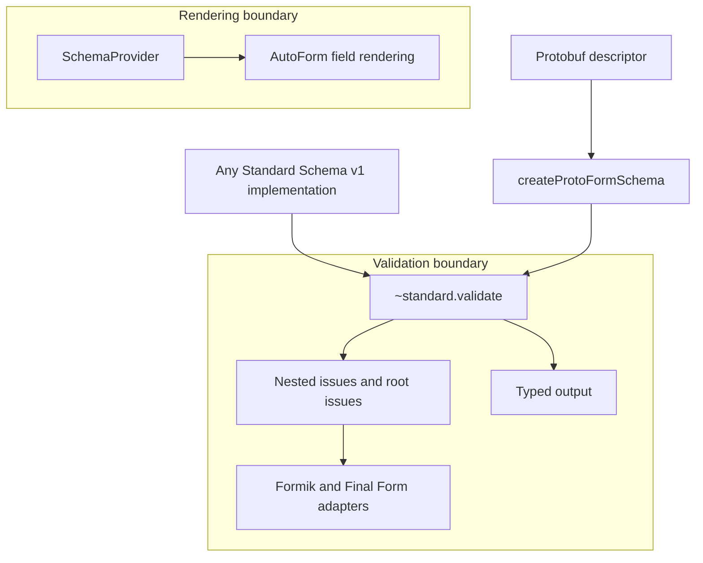

Protoform 将 [Standard Schema v1](https://standardschema.dev/schema) 作为其验证边界。
复制的 Protoform 核心依赖该标准，而不依赖 Zod、Valibot、ArkType 或其他
Schema 供应商。因此，符合该标准的实现可以使用相同的表单库适配器，无需
供应商特定的包或代码路径。

本页介绍受支持的契约。符合性表中列出的库是测试
证据，并非允许列表。

## 功能矩阵

| 功能 | 支持情况和行为 |
| --- | --- |
| 对象实现 | **支持。** 接受具有符合规范的 `~standard` 属性的对象 |
| 可调用实现 | **支持。** 接受同时公开符合规范的 `~standard` 属性的函数 |
| 同步验证 | **支持。** 无需强制使用 promise 即可返回表单错误 |
| 异步验证 | **支持。** Formik 和 Final Form 会等待验证完成 |
| 嵌套问题 | **支持。** 在嵌套错误树中保留字符串、数字和 `{ key }` 路径段 |
| 根级问题 | **支持。** 将无路径问题映射到表单库的根错误通道 |
| 多个问题 | **支持。** 保留所有问题，并用换行符连接同一字段的消息 |
| 类型化输出 | **支持。** 验证成功后可从 `~standard.validate` 获取 |
| `libraryOptions` | **支持。** 将供应商选项原样转发给 `~standard.validate` |
| 自动字段渲染 | **需要 provider。** AutoForm 需要 `SchemaProvider` 来提供字段、默认值和 UI 元数据 |

## 架构边界



Standard Schema 描述验证输入、类型化输出和问题。它不对字段
发现、默认值、控件、布局或 UI 注解进行标准化。这些渲染相关能力仍由
`SchemaProvider` 负责，因此添加其他 Schema 库不会改变 Protoform 的核心架构。

## Zod 4

Zod 4 直接实现 Standard Schema。可将 Zod Schema 传给 Protoform 适配器，无需 Zod
适配器或转换步骤：

```tsx
import { createFormikValidator } from "@/lib/core"
import * as z from "zod"

const profileSchema = z.object({
  profile: z.object({
    displayName: z.string().min(2),
  }),
})

const validate = createFormikValidator(profileSchema)
```

Zod 仅作为符合性测试依赖。Protoform 核心不会
导入它。

## Zod Mini

[Zod Mini](https://zod.dev/packages/mini) 通过其
函数式、可摇树优化的 API 公开相同的 Standard Schema 契约：

```tsx
import { createFormikValidator } from "@/lib/core"
import { minLength, object, string } from "zod/mini"

const profileSchema = object({
  profile: object({
    displayName: string().check(minLength(2)),
  }),
})

const validate = createFormikValidator(profileSchema)
```

Protoform 不检查 Zod 的类或方法。Zod 4 和 Zod Mini 与其他所有符合规范的实现一样，
都通过相同的 `~standard.validate` 接口接入。

## 适配器用法

适配器将 Standard Schema 问题转换为各表单库的嵌套错误结构。它们
不负责字段渲染或提交。

### Formik

Formik 接受同步或异步的表单级验证：

```tsx
import { createFormikValidator } from "@/lib/core"

const validate = createFormikValidator(profileSchema)
```

无路径问题使用 `_form`。请参阅完整的 [Formik 集成](/docs/formik)。

### Final Form

将 Final Form 的 `FORM_ERROR` 符号作为根问题键传入：

```tsx
import { createFinalFormValidator } from "@/lib/core"
import { FORM_ERROR } from "final-form"

const validate = createFinalFormValidator(profileSchema, {
  rootErrorKey: FORM_ERROR,
})
```

请参阅完整的 [Final Form 集成](/docs/final-form)。

TanStack Form 原生接受 Standard Schema。Protoform 的可选原生 facade 增加了 protobuf
消息、更新掩码、oneof 辅助函数和服务器错误映射，同时不替换 TanStack API。
请参阅 [TanStack Form 集成](/docs/tanstack-form)。React Hook Form 可以使用其通用的
`standardSchemaResolver`；protobuf 应用通常应优先使用其原生 `useProtoForm`
facade，以获得 protobuf 特有的问题映射和验证行为。

## 类型化输出和转换

表单库的验证回调返回错误，而不是 Schema 验证成功后的值。当 Schema 会转换输入或产生其他
输出类型时，请在提交处理程序中进行验证：

```tsx
import type { StandardSchemaV1 } from "@/lib/core"

type ProfileValues = StandardSchemaV1.InferInput<typeof profileSchema>

async function submit(values: ProfileValues) {
  const result = await profileSchema["~standard"].validate(values)
  if (result.issues) return

  await saveProfile(result.value)
}
```

`result.value` 保留 Schema 声明的输出类型。对于 Protoform protobuf Schema，它是
API 客户端所需的生成消息。

## 供应商库选项

如果某个实现支持额外的验证选项，可通过适配器传入：

```tsx
const validate = createFormikValidator(profileSchema, {
  libraryOptions: {
    locale: "en-GB",
  },
})
```

Protoform 会原样转发 `libraryOptions`，且不会解释供应商键。Schema
实现仍负责定义和支持这些选项。

## 符合性证据

| 实现 | 测试套件验证的内容 |
| --- | --- |
| Protoform protobuf Schema | Standard Schema 元数据、验证问题和类型化消息输出 |
| 可调用 fixture | 运行时检测和 `libraryOptions` 转发 |
| Zod 4 | 直接接受，并通过每个适配器映射嵌套问题 |
| Zod Mini | 直接接受，并通过每个适配器映射嵌套问题 |

使用以下命令运行公开证据：

```bash
bun run test:conformance -- -t "Standard Schema"
```

任何实现 Standard Schema v1 的库都应使用相同的接口。在声明某个指定库已经过验证之前，
请先添加符合性 fixture。
