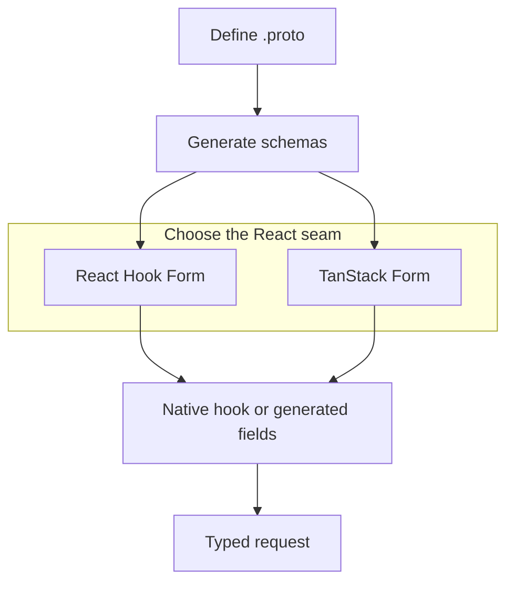

Protoform 是一个 shadcn 风格的表单注册表，以 protobuf 作为事实来源。
它结合了：

- **Protovalidate**：提供可在客户端和服务器端通用的验证规则。
- **React Hook Form**：作为默认生成的 AutoForm 引擎；此外还为 **TanStack Form** 提供原生 hook 和生成式 AutoForm。
- **Formik** 和 **Final Form** 验证适配器：适用于继续使用这些状态 API 的应用。
- **CEL 表达式**：用于条件业务规则。
- **AutoForm 注解**：根据 protobuf 描述符生成 UI。
- **Connect/gRPC 错误映射**：用于映射服务器端字段违规错误。
- **[Standard Schema](/docs/standard-schema)**：为其他表单库提供可移植的验证接口。
- **一致性测试套件**：覆盖描述符解析、验证、表单路径和值转换。
- **生产就绪度配置**：衡量已验证的覆盖范围，并列出所有剩余测试。
- **五个聚焦交互式演示中心**：涵盖 [Protobuf](/docs/protobuf-examples)、[Protovalidate](/docs/protovalidate-examples)、[CEL](/docs/cel-examples)、[生产行为](/docs/production-examples)和 AIP。
- **[每项适用 AIP 的实时表单](/docs/aip-example-catalog)**：集中在一个中心，并提供关联可执行兼容性证据的稳定深层链接。

## 存在的意义

大多数表单技术栈从 TypeScript schema 开始，随后逐渐偏离 API 契约。
Protoform 则以 protobuf 契约为起点：消息描述符可提供类型、验证、UI 元数据、oneof 结构、服务器错误路径和未来的代码生成 hook。

```bash
bunx shadcn@latest add @protoform/protoform
```

## 工作流程

1. 保留应用已使用的 React Hook Form 或 TanStack Form API。
2. 将原生 hook 导入替换为对应的 `useProtoForm(schema, options)`。
3. 使用 Protovalidate 注解，避免重复编写前端验证逻辑。
4. 使用 CEL 实现跨字段逻辑。
5. 为 proto 文件添加注解，以自动生成表单。
6. 将后端 `BadRequest.FieldViolation` 错误映射到具体字段。
7. 使用 LLM 迁移提示词逐步迁移 Zod schema。
8. 使用 `bun run test:conformance` 锁定公开行为。
9. 使用 `bun run readiness:report` 跟踪剩余的生产就绪工作。

现有 Protobuf-ES v1 应用应从
[v2 迁移指南](/docs/protobuf-v2-migration)开始；Protoform 仅接受 v2 生成的 schema。

请查看实时[生产就绪度仪表板](/docs/production-readiness)，了解 Protobuf、Protovalidate、CEL、Google AIP 和各运行时领域的当前评分。



{/* docs-directory:start */}
## 文档目录

使用以下正文链接直接访问每一篇持续维护的指南和示例。

- **AIP 示例:** [AIP 示例](/docs/zh/aip-example-catalog)
- **构建表单:** [步骤表单](/docs/zh/steppers), [AutoForm 注解](/docs/zh/auto-form), [Final Form](/docs/zh/final-form), [Formik](/docs/zh/formik), [Oneof 和边界情况](/docs/zh/oneof-edge-cases), [React Hook Form](/docs/zh/react-hook-form), [TanStack Form](/docs/zh/tanstack-form)
- **学习示例:** [厨房水槽](/docs/zh/kitchen-sink), [服务器错误表单](/docs/zh/server-error-form), [复杂的端到端示例](/docs/zh/complex-example), [极简表单](/docs/zh/bare-bones-form), [两步表单](/docs/zh/two-step-form), [深度嵌套表单](/docs/zh/deeply-nested), [AIP 资源表单](/docs/zh/aip-resource-form), [CEL 和 RE2 表单](/docs/zh/cel-re2-form), [Oneof 表单](/docs/zh/oneof-form)
- **功能示例:** [生产环境示例](/docs/zh/production-examples), [CEL 示例](/docs/zh/cel-examples), [Protobuf 示例](/docs/zh/protobuf-examples), [Protovalidate 示例](/docs/zh/protovalidate-examples)
- **迁移:** [从 Yup 迁移](/docs/zh/yup-migration), [从 Zod 迁移](/docs/zh/zod-migration), [迁移到 Protobuf-ES v2](/docs/zh/protobuf-v2-migration), [LLM 迁移手册](/docs/zh/llm-migration-playbook)
- **更多指南:** [预设](/docs/zh/presets)
- **生产环境:** [部署](/docs/zh/deployment), [测试表单](/docs/zh/testing-forms), [端口审计](/docs/zh/port-audit), [生产就绪度](/docs/zh/production-readiness), [一致性测试套件](/docs/zh/conformance)
- **开始使用:** [快速入门](/docs/zh/getting-started), [书店操作指南](/docs/zh/bookstore), [Registry 安装](/docs/zh/registry-install)
- **验证与 API:** [标准 Schema](/docs/zh/standard-schema), [服务器错误](/docs/zh/server-errors), [API 配方](/docs/zh/api-recipes), [CEL 表达式](/docs/zh/cel-expressions), [Google AIP 与 protobuf 设计](/docs/zh/aip-protobuf), [Protovalidate](/docs/zh/protovalidate)
{/* docs-directory:end */}
