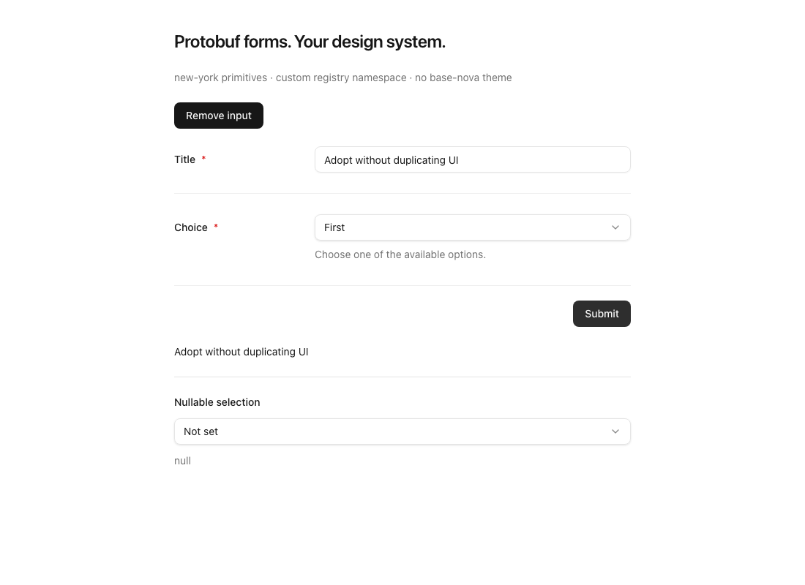
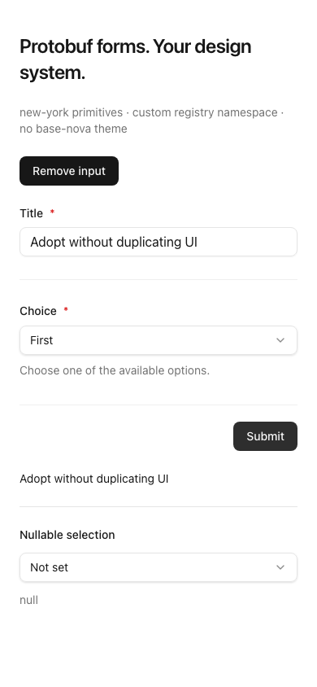
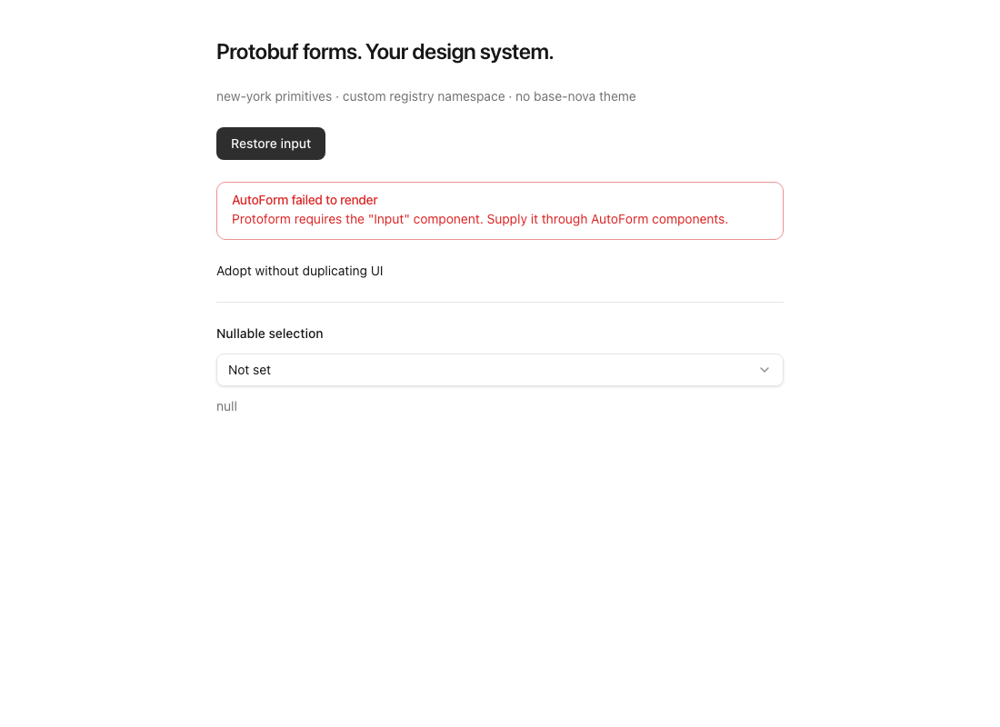
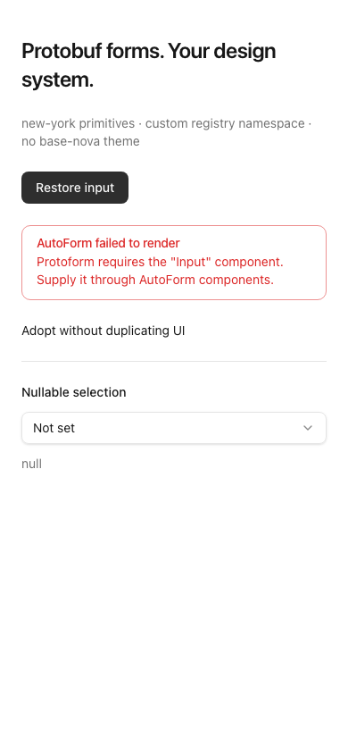

# Host-owned registry verification

## Reproduce

```bash
bun install --frozen-lockfile
bun run registry:build
bun run registry:consumer-smoke
bunx --no-install playwright test --config playwright.host-registry.config.ts
```

The consumer smoke uses the repository's locked shadcn CLI. It creates disposable fixtures under
`.tmp/` and requires network access for the host registry and npm dependencies. Run it serially:
the fixtures and local registry port are shared. `--host-only` skips the older bundles when iterating.

The host fixture uses `new-york`, an independently configured `@host` registry namespace, and
separate nested aliases for UI, components, hooks, and library files. Before installing Protoform,
it records the contents of 20 existing upstream UI files, the host stylesheet, utilities, and
`components.json`. After installation it verifies byte equality and that no extra primitives appeared.
It then typechecks and server-renders the installed AutoForm, not repository source aliases.
The other fixtures typecheck core-only and legacy installs, including the experimental form engines.

## Browser coverage

Chromium at 1100×800 and 390×844:

- Computed host theme color and full-width input: fail if CSS is missing.
- Required select placeholder and selection.
- Submit through the host's input and button.
- Remove a required UI mapping; show the missing component by name.
- Restore the mapping with the same schema; recover without remounting the entire app.
- Empty submission, visible validation feedback, correction, and successful resubmission.
- Distinguish an unset selection from the literal string `"null"`.
- No uncaught browser errors. React's development error-boundary report during the intentional
  missing-component step is expected.

| Desktop | Mobile |
| --- | --- |
|  |  |
|  |  |

These are new-host-entrypoint baselines, not screenshots of a redesigned legacy form. The fixture's
Tailwind v4 stylesheet and neutral theme are consumer-owned and are not shipped by Protoform.
The Vite Tailwind plugin compiles both installed primitives and Protoform classes; the browser imports
the stylesheet. The original handwritten-CSS snapshots were inadequate styling evidence and are replaced.

## Scope and limitations

- This draft's host entrypoint uses React Hook Form v7. The existing experimental/TanStack AutoForm
  entrypoints keep their legacy maps; hook-only installations remain independent of UI.
- The supplied adapter targets Radix-style shadcn APIs. A Base UI or bespoke registry may need its
  own adapter; matching component names alone does not prove matching behavior.
- Specialized combobox, multiselect, choicebox, JSON, and key/value controls need explicit host
  mappings or custom field renderers. They are not silently replaced with weaker controls.
- No existing consumer files are deleted. Migration of previously copied UI remains a reviewed,
  consumer-owned operation.
- No primitive implementations or themes were changed. Most extra source-file changes are import
  paths needed to support independently nested aliases. The internal field-mask renderer was renamed
  to avoid shadcn confusing it with the protobuf field-mask helper during import rewriting.
