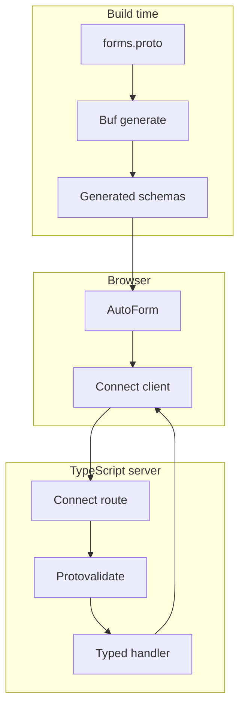

# TypeScript examples

These examples use one protobuf contract across a React browser client and a ConnectRPC TypeScript
server. They do not require another language runtime or a second build system.

## Run them

```bash
bun install
bun run examples:generate
bun run examples:dev
```

The Blume docs app starts at `http://localhost:55011/docs` and the example API listens on
`http://127.0.0.1:55012`. You can also run `bun run examples:server` and `bun dev` in separate
terminals.

## Structure

| Path | Purpose |
| --- | --- |
| `proto/protoform/examples/v1/*.proto` | Focused learning contracts plus shared RPC and advanced-example messages |
| `gen/` | Generated Protobuf-ES descriptors and message types |
| `learning/` | Bare-bones, two-step, CEL/RE2, oneof, and AIP examples |
| `basic/` | Focused descriptor-to-server error flow |
| `complex/` | Four-step flow with a oneof, redacted review summary, and error routing |
| `tanstack/` | Manual TanStack Form fields using the protobuf Standard Schema contract |
| `form-libraries/` | Formik and Final Form live examples plus shared adapter fixtures |
| `server/` | Node.js ConnectRPC server with the validation interceptor |
| `apply-server-errors.ts` | `google.rpc.BadRequest` field-path mapping for AutoForm |

## End-to-end contract



The browser resolver and server interceptor execute the same protobuf validation rules. The
protobuf provider also exposes them through Standard Schema v1, so validation is not coupled to
React Hook Form.

## Error mapping

The handlers return canonical Connect codes and structured `google.rpc.BadRequest` details. The
client maps protobuf paths such as `project_id` to form paths such as `projectId`, shows every
unmapped violation at the form root, and returns a failed stepper submission to the step that owns
the first field error.

## Scope and limitations

- The in-memory handlers demonstrate transport, validation, and recovery; they do not persist data.
- The custom `Submit*` RPCs are workflow examples, not resource-oriented standard methods. Resource
  APIs should use standard create and update request shapes with `parent`, `{resource}_id`, resource
  messages, field masks, and etags.
- Step IDs are stable presentation metadata. Conditional fields can live inside a step, but the
  ordered step list should not change while a user is completing the form.
- Step ownership currently applies to top-level request fields and oneofs. Unannotated or unknown
  step IDs fall back to the first step.
- Review summaries must redact credentials and other sensitive values. The complex example shows a
  custom summary that never displays the API key.
